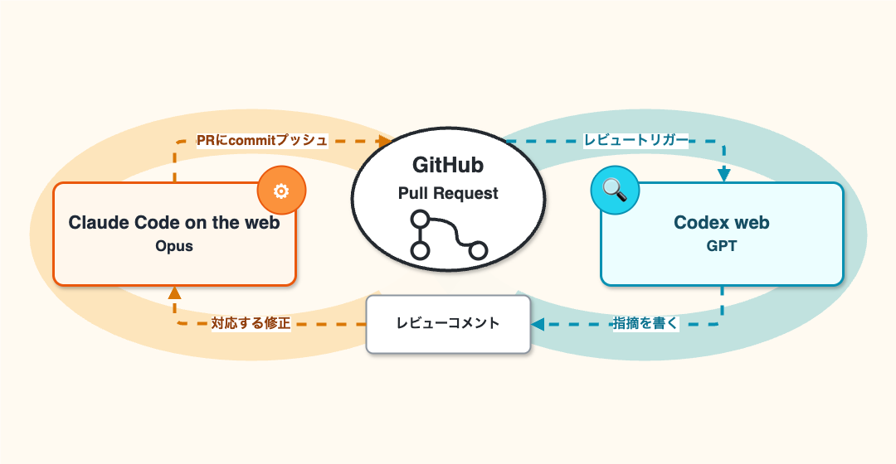

:ogp_title: 続・Claude Codeで実装、 Codexでレビュー、合わせて自走の企て
:ogp_event_name: aidd-auto-pilot2
:ogp_slide_name: claude-codex-combined-loop
:ogp_description: 【AI駆動開発】AI自走環境整備・運用スペシャル #2
:ogp_image_name: aidd-auto-pilot2

============================================================
続・Claude Codeで実装、 Codexでレビュー、合わせて自走の企て
============================================================

続・Claude Codeで実装、 Codexでレビュー、合わせて自走の企て
============================================================

:Event: 【AI駆動開発】AI自走環境整備・運用スペシャル #2
:Presented: 2026/05/19 nikkie （スペース連打 or 矢印キーでめくります）

お前、誰よ？（**Python使い** の自己紹介）
============================================================

* nikkie(にっきー) `Codex Ambassador (Tokyo) <https://x.com/ftnext/status/2051929099992707217>`__ [#nikkie-llm-tool-stance]_
* 機械学習エンジニア（`We're hiring! <https://hrmos.co/pages/uzabase/jobs/1829077236709650481>`__）・`Speeda AI Agent <https://www.uzabase.com/jp/info/20250901/>`__ 開発（`A2A提供 <https://jp.ub-speeda.com/news/20260319/>`__）

.. image:: ../_static/uzabase-white-logo.png

.. [#nikkie-llm-tool-stance] Codexに絞らず「全部触ればええんや」精神で、決して触り切れてはいないですが、手を出し続けています

**自走** に強い興味 [#2026-auto-pilot-article]_
------------------------------------------------------------

.. raw:: html

    <iframe class="speakerdeck-iframe" style="border: 0px; background: rgba(0, 0, 0, 0.1) padding-box; margin: 0px; padding: 0px; border-radius: 6px; box-shadow: rgba(0, 0, 0, 0.2) 0px 5px 40px; width: 100%; height: auto; aspect-ratio: 560 / 315;" frameborder="0" src="https://speakerdeck.com/player/6f8da4e8af70435693f4fdd940e956e4?slide=3" title="夜を制する者が “AI Agent 大民主化時代” を制する" allowfullscreen="true" allow="web-share" data-ratio="1.7777777777777777"></iframe>

.. [#2026-auto-pilot-article] `散文：夜に駆ける <https://nikkie-ftnext.hatenablog.com/entry/memorandum-auto-pilot-coding-agent-at-night-202602>`__

最近の自走トピック：Codex Appの **自動レビュー**
----------------------------------------------------------------------

.. raw:: html

    <blockquote class="twitter-tweet" data-lang="ja" data-align="center" data-dnt="true">
Auto-review is a new mode that lets Codex work longer with fewer approvals and safer execution.  It helps Codex keep moving through tests, builds, and more, including during long tasks and automations, while a separate agent checks higher-risk steps in context before they run. <a href="https://t.co/TCcNC5yB0H">pic.twitter.com/TCcNC5yB0H</a>
&mdash; OpenAI Developers (@OpenAIDevs) <a href="https://twitter.com/OpenAIDevs/status/2047436655863464011?ref_src=twsrc%5Etfw">2026年4月23日</a></blockquote> 

人間の承認を不要にする流れ🔥
------------------------------------------------------------

* Codex Appの自動レビュー（前頁） [#codex-auto-review-episode]_
* Claude Codeも `オートモード <https://code.claude.com/docs/ja/auto-mode-config>`__

    * Claudeサブスクリプション外（例：`Google Vertex AI <https://code.claude.com/docs/ja/google-vertex-ai>`__）でも使えるようにしてほし〜

.. [#codex-auto-review-episode] `obra/superpowers <https://github.com/obra/superpowers>`__ で作った4000行超プランをCodex Appの自動レビューに渡したら2時間ほど自走！🙌 しかし、費用面でやらかしていた...（俺みたいになるな！）

前回楽しんでいただきありがとうございました
============================================================

.. raw:: html

    <iframe width="800" height="480" src="https://ftnext.github.io/2026-slides/aidd-auto-pilot1/claude-codex-combined-loop.html#/4/2"
        title="Claude Codeで実装、 Codexでレビュー、合わせて自走の企て"></iframe>

Opusで実装、GPTでレビュー、takt🎼でループ
------------------------------------------------------------

.. raw:: html

    <iframe width="800" height="480" src="https://ftnext.github.io/2026-slides/aidd-auto-pilot1/claude-codex-combined-loop.html#/5/3"
        title="Claude Codeで実装、 Codexでレビュー、合わせて自走の企て"></iframe>

taktワークフローを育てていきたかったのですが...
------------------------------------------------------------

* taktは `@anthropic-ai/claude-agent-sdk <https://www.npmjs.com/package/@anthropic-ai/claude-agent-sdk>`__ に依存
* 「*API キー認証方法を使用してください。*」（`はじめに（Agent SDK の概要） <https://code.claude.com/docs/ja/agent-sdk/overview#%E3%81%AF%E3%81%98%E3%82%81%E3%81%AB>`__）
* ProやMaxのサブスクリプションがSDKに使えなくなり、APIキー追加課金を要求されてしょんぼり😞 [#openai-subscription-contrast]_

.. [#openai-subscription-contrast] 対照的にOpenAIは今のところ制限がゆるくて、無料アカウントでもCodexの枠があります

6月（来月）から月次クレジット付与へ [#june-claude-agent-sdk-with-claude-plan]_ 🏃‍♂️
------------------------------------------------------------------------------------------

.. raw:: html

    <blockquote class="twitter-tweet" data-lang="ja" data-align="center" data-dnt="true">
Starting June 15, paid Claude plans can claim a dedicated monthly credit for programmatic usage.  The credit covers usage of: - Claude Agent SDK - claude -p - Claude Code GitHub Actions - Third-party apps built on the Agent SDK
&mdash; ClaudeDevs (@ClaudeDevs) <a href="https://twitter.com/ClaudeDevs/status/2054610152817619388?ref_src=twsrc%5Etfw">2026年5月13日</a></blockquote>

.. [#june-claude-agent-sdk-with-claude-plan] `Claude プランで Claude Agent SDK を使用する <https://support.claude.com/ja/articles/15036540-claude-%E3%83%97%E3%83%A9%E3%83%B3%E3%81%A7-claude-agent-sdk-%E3%82%92%E4%BD%BF%E7%94%A8%E3%81%99%E3%82%8B>`__

合わせて自走、**別の実現方法** を模索へ
------------------------------------------------------------

2つ紹介します

1️⃣ Codex plugin for Claude Code
============================================================

* taktのループを別のやり方で実現
* **ClaudeからCodex（のレビュー）を呼び出す** プラグイン
* :fab:`github` `openai/codex-plugin-cc <https://github.com/openai/codex-plugin-cc>`__

記事「Claude Code 向け Codex Plugin の紹介」
------------------------------------------------------------

.. raw:: html

    <blockquote class="twitter-tweet" data-lang="ja" data-align="center" data-dnt="true">
<a href="https://t.co/hTMgd7ozpm">https://t.co/hTMgd7ozpm</a>
&mdash; Vaibhav (VB) Srivastav (@reach_vb) <a href="https://twitter.com/reach_vb/status/2039251986357338257?ref_src=twsrc%5Etfw">2026年4月1日</a></blockquote>

Claude Code のプラグインとしてインストール [#codex-plugin-cc-version]_
----------------------------------------------------------------------

.. code-block:: bash
    :caption: Claude Codeのセッションで

    /plugin marketplace add openai/codex-plugin-cc
    /plugin install codex@openai-codex
    /reload-plugins

.. code-block:: bash
    :caption: または、ターミナルで

    claude plugins marketplace add openai/codex-plugin-cc
    claude plugins install codex@openai-codex

.. [#codex-plugin-cc-version] 私の環境は1.0.3ですが、最新は `1.0.4 <https://github.com/openai/codex-plugin-cc/releases/tag/v1.0.4>`__ です

**レビューゲート** の設定
------------------------------------------------------------

.. code-block:: bash
    :caption: Stopフックが参照する変数を設定

    /codex:setup --enable-review-gate

.. code-block:: bash
    :caption: 仕組み：実はフックが既に有効
    :emphasize-lines: 3

    /hooks
    9.  SessionStart (1)     When a new session is started
    10. Stop (1)             Right before Claude concludes its response
    16. SessionEnd (1)  When a session is ending

Claude Codeの実装が終わると、Codexがレビュー！
------------------------------------------------------------

* Opus 4.7 (1M)と一緒にプラン
* レビューゲートを有効にして、実装開始（オートモード）
* Opusが実装を終える [#why-advisor-tool]_ と、 **Codex(GPT-5.5)がレビュー** （``codex review`` 相当）

.. [#why-advisor-tool] セッションを遡ったところ、私の環境だけかもしれませんが、Opusモデルもなぜか `advisor <https://platform.claude.com/docs/ja/agents-and-tools/tool-use/advisor-tool>`__ にレビュー求めてました。「*advisor に最終チェックしてもらってから*」

もう1つのレビュー：adversarial-review
------------------------------------------------------------

* ``codex review`` とは別に、**プロンプトを組み立てる** レビュー
* https://github.com/openai/codex-plugin-cc/blob/v1.0.4/plugins/codex/prompts/adversarial-review.md
* **厳しい** 印象。30分超えでレビューループが走っていた [#adversarial-review-story]_

.. [#adversarial-review-story] 私の環境だけな気がしますが、Claude Codeはreview gateが通ってないのに止まってしまった（「*正直に言うと、まだ確認取れてない*」）ので、adversarial-reviewに叩き込みました（Stopフック未発火？）

taktに代わるレビューループを手に入れた！が
------------------------------------------------------------

* PCが占拠される（閉じれらない）
* そのままでは眩しくて **眠れない** ...（MacBookのディスプレイ一番暗くして一晩放置）

2️⃣ Web環境の利用
============================================================

* Claude Code on the webで（実装・）修正
* Codex webによるレビュー

Claude Code on the web
============================================================

* https://claude.ai/code
* 皆さん使ってますか？🙋
* 📃 `ウェブ上の Claude Code を使用する <https://code.claude.com/docs/ja/claude-code-on-the-web>`__ [#how-to-start-cc-web]_

.. [#how-to-start-cc-web] 「*始めるには GitHub リポジトリが必要です。*」（📃 `Claude Code をウェブで始める <https://code.claude.com/docs/ja/web-quickstart>`__）

**行** き来：ローカルからWebセッション開始
------------------------------------------------------------

* ``claude --remote <prompt>``
* ローカル作業ディレクトリのリモートのGitHubリポジトリをclone
* **複数** 投げられる（並列する別セッション扱い）
* （`/ultraplan <https://code.claude.com/docs/ja/ultraplan>`__ なんてものも。存在だけ紹介）

行き **来**：Webのセッションをローカルへ
------------------------------------------------------------

* ``claude --teleport``
* ``/teleport``
* ``/tasks``

ローカルでPRまで作って、 **レビュー対応はWebで**
------------------------------------------------------------

* 📃 `プルリクエストの自動修正 <https://code.claude.com/docs/ja/claude-code-on-the-web#%E3%83%97%E3%83%AB%E3%83%AA%E3%82%AF%E3%82%A8%E3%82%B9%E3%83%88%E3%81%AE%E8%87%AA%E5%8B%95%E4%BF%AE%E6%AD%A3>`__
* ``/autofix-pr``

    現在のブランチの PR を監視し、CI が失敗するか、レビュアーがコメントを残したときに修正をプッシュする Claude Code on the web セッションを生成します。（`/autofix-pr <https://code.claude.com/docs/ja/commands>`__）

.. revealjs-break::
    :notitle:

.. raw:: html

    <blockquote class="twitter-tweet" data-lang="ja" data-align="center" data-dnt="true">
Claude Codeの最近の更新で一番好きなのは、/autofix-pr🌩️ CLIで実行すると、クラウド（ウェブ）のセッションが起動し、PRのCIやレビューコメントを監視してくれる。CIが落ちたり、他の人やAIがレビューをすると、勝手にそれに反応し、修正してくれる🚀… <a href="https://t.co/WpbIKh5vN1">pic.twitter.com/WpbIKh5vN1</a>
&mdash; 鹿野 壮 Takeshi Kano (@tonkotsuboy_com) <a href="https://twitter.com/tonkotsuboy_com/status/2047306307674558761?ref_src=twsrc%5Etfw">2026年4月23日</a></blockquote>

nice to have: 私は ``gh`` も追加してます [#sorry-no-ablation]_
----------------------------------------------------------------------

* Oikonさんによる `gh-setup-hooks <https://github.com/oikon48/gh-setup-hooks>`__ [#oikon-san-gh-setup-hooks]_
* 「`セットアップスクリプト <https://code.claude.com/docs/ja/claude-code-on-the-web#%E3%82%BB%E3%83%83%E3%83%88%E3%82%A2%E3%83%83%E3%83%97%E3%82%B9%E3%82%AF%E3%83%AA%E3%83%97%E3%83%88>`__」ドキュメントに記載入ってました

.. code-block:: bash

    #!/bin/bash
    apt update && apt install -y gh

.. [#oikon-san-gh-setup-hooks] https://x.com/oikon48/status/2009948087574536490

.. [#sorry-no-ablation] ⚠️ ``gh`` を入れないと壊れるのかablationできていません

Codex web (Codex cloud)
============================================================

* https://chatgpt.com/codex/cloud （5月頭にこのURLに変わった）
* 皆さん使ってますか？🙋
* 📃 `Codex web <https://developers.openai.com/codex/cloud>`__ (*Delegate to Codex in the cloud*)

イチ推しは **レビュー**！
------------------------------------------------------------

.. raw:: html

    <iframe width="560" height="315" src="https://www.youtube-nocookie.com/embed/HwbSWVg5Ln4?si=1QTOtj7dLt-acNII&amp;start=83" title="YouTube video player" frameborder="0" allow="accelerometer; autoplay; clipboard-write; encrypted-media; gyroscope; picture-in-picture; web-share" referrerpolicy="strict-origin-when-cross-origin" allowfullscreen></iframe>

レビューは **簡単に設定** できて
------------------------------------------------------------

.. image:: ../_static/aidd-auto-pilot2/codex-web-review-easy-setting.png
    :target: https://chatgpt.com/codex/cloud/settings/code-review
    :scale: 60%

📃 `Codex code review in GitHub <https://developers.openai.com/codex/integrations/github>`__

めちゃめちゃ助けてくれる（👍の安心感！） [#cc-desktop-alternative-failure]_
--------------------------------------------------------------------------------

* diffを見るだけでなく、クラウド環境で **コマンド実行** （先の動画参照）
* ログ https://chatgpt.com/codex/cloud?tab=code_reviews
* 救われた例「今回GitHub Action落ちますね」

.. [#cc-desktop-alternative-failure] Codex webによるレビューと、DesktopアプリのClaude Codeの「CIを自動修正してコメントに対応」の組合せは、ClaudeのAPIエラーでソケット接続が切れており、一晩で終わらず...

実装は正直微妙（※GW時点） [#codex-web-money]_
------------------------------------------------------------

* ``gh`` コマンドを渡してみるも「PR作れませんでした」頻発（`AGENTS.md <https://github.com/ftnext/millionlive-shadow-bout/blob/4dd98c8322ffcaea273875cce1919a8f280d9639/AGENTS.md#github-gh-%E5%88%A9%E7%94%A8%E5%89%8D%E6%8F%90>`__）
* セッションで続けて「gh使って」と指示しても、謎の変更を加えたPR作る（セッションを引き継げてない？）
* ローカルの **Codex App** に切り替えました

.. [#codex-web-money] 費用について：**ChatGPT Plusの枠内でレビューは全然使える感覚** です（追加課金不要）。webでの実装は消費枠大きい上に言うこと聞かないことが多くオススメしません

構築したWebの自走環境
============================================================

事例：**通勤中** に自作OSS開発
------------------------------------------------------------

* ClaudeのモバイルからwebでPlan。実装してPR作成まで
* リポジトリに設定してあるCodex webのレビュー
* レビューコメントがGitHubからメール通知されたら、人力でClaudeに「レビューコメント確認して対応して」 [#improvement-autofix-pr]_

.. [#improvement-autofix-pr] 1回人力キックした後次のレビューが通らないなら、PCで ``/autofix-pr`` してwebに張り付かせる機会を伺います

事例：夜間や勤務裏の自走
------------------------------------------------------------

* 実装とレビューで **20往復**！！ [#20-review-rounds-example]_
* Codexがコーナーケースを指摘しまくり、差分300行 -> 800行（2倍強）
* 感想：**家電** だなあ（洗濯機や食洗機のように放っておける）

.. [#20-review-rounds-example] https://github.com/ftnext/happy-python-logging/pull/3

まとめ🌯：続・Claude Codeで実装、 Codexでレビュー、合わせて自走の企て
======================================================================

* 自分のマシンで：takt -> **Codex plugin for Claude Code**
* Webで：Claude Code on the **web** で実装 + Codex **web** でレビュー

使い分け
------------------------------------------------------------

* **自分がオーナー** で好きに設定できるリポジトリでは **Webパターン** （後者）を設定
* メンテナのリポジトリでは自分のマシンのパターン（前者）で進める

想定質問：ClaudeもGPTもどちらも必須ですか？
------------------------------------------------------------

* 発表時点では **必要**
* Codex webのレビューは本当に助かる（Claudeの実装にはだいたいGPTのP1・P2指摘が入る）
* 💡Claudeのautofix-prを自作できれば、GPTだけに寄せられるかも？

ご清聴ありがとうございました
------------------------------------------------------------

Happy Development ❤️🤖

何か1つでも試そうというものがあったら嬉しいです！

OSSサポートに感謝申し上げます
------------------------------------------------------------

* `SpeechRecognition <https://github.com/Uberi/speech_recognition>`__ (9k star) メンテナ
* `Claude for Open Source <https://claude.com/contact-sales/claude-for-oss>`__
* `Codex for Open Source <https://openai.com/ja-JP/form/codex-for-oss/>`__

EOF
===
