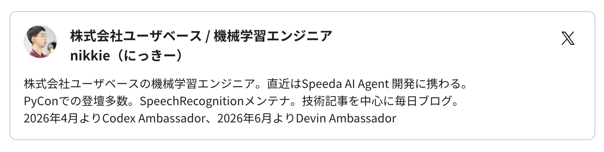

============================================================
困難は分割せよ
============================================================

:Event: 【AI駆動開発】AI自走環境整備・運用スペシャル #4
:Presented: 2026/07/21 nikkie （スペース連打 or 矢印キーでめくります）

お前、誰よ
============================================================

* nikkie（にっきー） [#nikkie-uuid]_ ・`Codex Ambassador (Tokyo) <https://nikkie-ftnext.hatenablog.com/entry/announcement-one-of-codex-ambassadors-tokyo>`__・Devin Ambassador
* 機械学習エンジニア・`Speeda AI Agent <https://www.uzabase.com/jp/info/20250901/>`__ 開発（`A2A <https://jp.ub-speeda.com/news/20260319/>`__・`MCP <https://jp.ub-speeda.com/news/20260701/>`__ 提供）

.. image:: ../_static/uzabase-white-logo.png

.. [#nikkie-uuid] UUID `28fb3f96-a221-462c-93bd-567b431715b9 <https://x.com/ftnext/status/2041119610368602138>`__

本日公開のインタビューより
---------------------------------------------------

https://findy-code.io/media/articles/chotto-wakaru-python

「複数コーディングエージェントを並列で走らせる」
============================================================

    今回は、レビュー中心の議論から軸を変え、Issue自動生成 → タスク分解 → 複数エージェントによるPR作成までを、どこまでAIに自走させられるか

https://aid.connpass.com/event/399888/

サブエージェント
---------------------------------------------------

* コーディングエージェントを長く自走させたい！
* **コンテキストウィンドウ管理**：メインが詳細を知る必要がなければサブに振る
* 経験した事例を3つ紹介

.. _obra/superpowers: https://github.com/obra/superpowers

1/3 `obra/superpowers`_
============================================================

* ソフトウェア開発のやり方を強制（例えば、red/green TDD）
* 多様なコーディングエージェントをサポート
* サブエージェントを並列で走らせるのを体験した

.. Claude plugin, Codex plugin

強制する流れ
---------------------------------------------------

1. brainstorming (:file:`specs/design.md`)
2. writing-plans (:file:`plans/<feature>.md`)
3. **subagent-driven-development**

planをサブエージェントで分担して実装
---------------------------------------------------

* コードベース探索+人間に質問で :file:`design.md` ができる
* どのファイルがどんな差分になるかを :file:`plans` に書き出す（**1000行**〜）
* サブエージェントに委譲して、クリアなコンテキストで動作するまで実装

2/3 orchestrator (Fable 5)
============================================================

* superpowersを設定しなくてもサブエージェント並列呼び出しができるようになってきた

.. revealjs-break::
    :notitle:

.. raw:: html

    <blockquote class="twitter-tweet" data-conversation="none" data-lang="ja" data-align="center" data-dnt="true">
A second strategy: use Fable 5 as an orchestrator.  Fable 5 plans and delegates to workers (Sonnet 5).  Most tokens are billed at the lower worker rate. <a href="https://t.co/cwDZJSXekn">pic.twitter.com/cwDZJSXekn</a>
&mdash; ClaudeDevs (@ClaudeDevs) <a href="https://x.com/ClaudeDevs/status/2074606061567574181?ref_src=twsrc%5Etfw">2026年7月7日</a></blockquote> 

リファクタリング計画
---------------------------------------------------

.. raw:: html

    <blockquote class="twitter-tweet" data-lang="ja" data-align="center" data-dnt="true">
6月22日までしかサブスクで使えない期間限定で登場した最強のFable 5を全力で活かすプロンプトをお教えします  「今このコードベースには長年蓄積した大量の無駄がある。フェーズに分けて完全なリファクタリングを行うための詳細なプランを書いてほしい」  これで徹底的に内部解析した出力を得ておく…
&mdash; Kenn Ejima (@kenn) <a href="https://x.com/kenn/status/2064590494106317289?ref_src=twsrc%5Etfw">2026年6月10日</a></blockquote>

サブエージェントで実装
---------------------------------------------------

* 実装計画 https://github.com/ftnext/kurenai/issues/4

    * フェーズ1〜3

* Fableに指示「Sonnet 5をサブエージェントとし、それぞれにプルリクエストを作らせ、あなたは監督に当たってください」

.. Oikonさんツイートでうまくやる方法を見た https://x.com/oikon48/status/2074667273009385790

3/3 Codexからもサブエージェント
============================================================

* PDFとJSONの内容突き合わせを100回
* GPT-5.6 Sol (高)にタスクを監督させてサブエージェントに処理させた（ChatGPT.app）

.. サブエージェントを指定してないのでSolになる

Codexの設定
---------------------------------------------------

* configの ``[agents]`` (``max_threads = 6``)
* 指示は :file:`AGENTS.md` に記載。各エージェントが自動で読み込むため

共通点：巨大な1タスクを **分割** して作業
============================================================

* 1000行のplan
* リファクタリング計画の実装
* 100回繰り返し

自走環境に向けて（私自身未開）
---------------------------------------------------

* 「Issue自動生成 → タスク分解 → 複数エージェントによるPR作成」(connpass)
* 巨大な1タスクと性質が異なる感触。事前に定義できる？
* 可能性？：Agent Team、Dynamic Workflow

まとめ🌯：困難は分割せよ
============================================================

* 巨大な1タスクを分割してサブエージェントに実装させてきた
* superpowersから始め、最近のモデルではサブエージェントは簡単に
* Open Question: 複数のタスクをつないで自走させるには？

ご清聴ありがとうございました
------------------------------------------------------------

Happy Development ❤️🤖（ステッカードゾー）

OSSサポートに感謝申し上げます
------------------------------------------------------------

* `SpeechRecognition <https://github.com/Uberi/speech_recognition>`__ (9k star) メンテナ
* `Claude for Open Source <https://claude.com/contact-sales/claude-for-oss>`__
* `Codex for Open Source <https://openai.com/ja-JP/form/codex-for-oss/>`__

EOF
===
