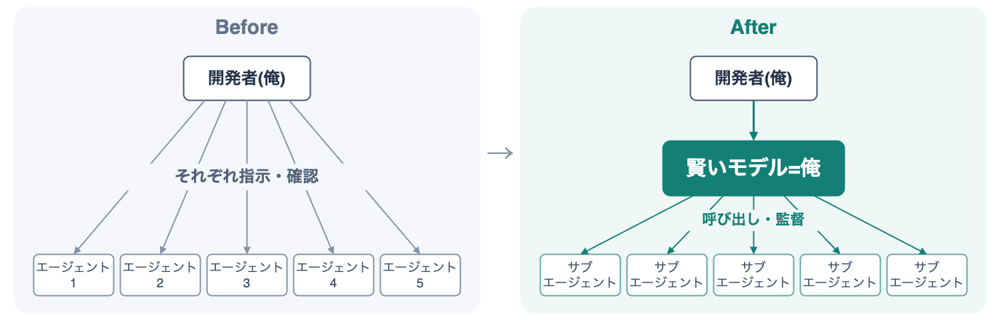

:ogp_title: オーケストレータ 俺
:ogp_event_name: aidd-auto-pilot6
:ogp_slide_name: orchestrator-ore
:ogp_description: 【AI駆動開発】AI自走環境整備・運用スペシャル #6
:ogp_image_name: aidd-auto-pilot6

============================================================
オーケストレータ 俺
============================================================

:Event: 【AI駆動開発】AI自走環境整備・運用スペシャル #6
:Presented: 2026/09/15 nikkie （スペース連打 or 矢印キーでめくります）

オーケストレータ 俺、とは [#title-secret]_
============================================================

* **賢いモデル** にサブエージェントを **監督** させている
* *自分を複製できた感覚* を共有したい

.. [#title-secret] インスパイア「`魔法少女 俺 <https://magicalgirl-ore.com/>`__」

お前、誰よ
============================================================

* nikkie（にっきー） [#nikkie-uuid]_ ・`Codex Ambassador (Tokyo) <https://nikkie-ftnext.hatenablog.com/entry/announcement-one-of-codex-ambassadors-tokyo>`__・Devin Ambassador
* 機械学習エンジニア・`Speeda AI Agent <https://www.uzabase.com/jp/info/20250901/>`__ 開発（`A2A <https://jp.ub-speeda.com/news/20260319/>`__・`MCP <https://jp.ub-speeda.com/news/20260701/>`__・`Slackbot <https://jp.ub-speeda.com/news/20260910/>`__ 提供）
* 発表： `#1 <https://ftnext.github.io/2026-slides/aidd-auto-pilot1/claude-codex-combined-loop.html#/1>`__ & `#2 <https://ftnext.github.io/2026-slides/aidd-auto-pilot2/claude-codex-combined-loop.html#/1>`__ （レビューのループ） `#4 <https://ftnext.github.io/2026-slides/aidd-auto-pilot4/various-subagents.html>`__ （サブエージェント）

.. image:: ../_static/uzabase-white-logo.png

.. [#nikkie-uuid] UUID `28fb3f96-a221-462c-93bd-567b431715b9 <https://x.com/ftnext/status/2041119610368602138>`__

関心は「夜のブルーオーシャン」
============================================================

.. raw:: html

    <iframe class="speakerdeck-iframe" style="border: 0px; background: rgba(0, 0, 0, 0.1) padding-box; margin: 0px; padding: 0px; border-radius: 6px; box-shadow: rgba(0, 0, 0, 0.2) 0px 5px 40px; width: 100%; height: auto; aspect-ratio: 560 / 315;" frameborder="0" src="https://speakerdeck.com/player/6f8da4e8af70435693f4fdd940e956e4?slide=3" title="夜を制する者が “AI Agent 大民主化時代” を制する" allowfullscreen="true" allow="web-share" data-ratio="1.7777777777777777"></iframe>

今やコーディングエージェントに任せておける [#blue-ocean-fyi]_
----------------------------------------------------------------------

* **ランチ休憩** の裏でタスクを振り、それができた状態で再開
* **家事** の裏で個人開発進める

.. [#blue-ocean-fyi] 「`生産システム <https://youtu.be/qUxjJywT1aw?si=MBy9NG1yVhW9eYmj>`__」・*ファクトリー* といった言葉が浮かんできます

エージェントがエージェントを呼ぶ
============================================================

* Fable 5以降で成立した **自走の新たな選択肢**
* 動的にサブエージェント呼び出し（`dynamic workflows <https://claude.com/blog/introducing-dynamic-workflows-in-claude-code>`__）

.. revealjs-break::
    :notitle:

.. raw:: html

    <blockquote class="twitter-tweet" data-conversation="none" data-lang="ja" data-align="center" data-dnt="true">
A second strategy: use Fable 5 as an orchestrator.  Fable 5 plans and delegates to workers (Sonnet 5).  Most tokens are billed at the lower worker rate. <a href="https://t.co/cwDZJSXekn">pic.twitter.com/cwDZJSXekn</a>
&mdash; ClaudeDevs (@ClaudeDevs) <a href="https://x.com/ClaudeDevs/status/2074606061567574181?ref_src=twsrc%5Etfw">2026年7月7日</a></blockquote> 

.. revealjs-break::
    :notitle:

.. raw:: html

    <blockquote class="twitter-tweet" data-lang="ja" data-align="center" data-dnt="true">
I talk to engineers at other companies every day and hear the same thing: one person is 10x&#39;ing their output with Claude but the rest of the org hasn&#39;t caught up.  Watching teams adopt AI, I keep seeing the same 4 steps.  I mapped them out here: Steps of AI Adoption…
&mdash; Boris Cherny (@bcherny) <a href="https://x.com/bcherny/status/2077929379661844559?ref_src=twsrc%5Etfw">2026年7月17日</a></blockquote> 

Steps of AI Adoption (boris-san [#claude-artifact-demo]_) 抜粋 [#ja-translation-by-oikon-san]_
----------------------------------------------------------------------------------------------------

* Step 2：1人のエンジニアが一度に5-10のエージェント
* Step 3へ：「ClaudeにClaudeを起動させる」

.. [#claude-artifact-demo] `Claude Codeのartifact機能 <https://claude.com/blog/artifacts-in-claude-code>`__ のデモも兼ねてだと思ってます

.. [#ja-translation-by-oikon-san] Oikonさんによる日本語訳：https://x.com/oikon48/status/2077932711411679404

skillをFableに与えた
============================================================

* `Fableはお高い <https://www.anthropic.com/claude/fable>`__ ので高額請求が怖い
* 「Fable、あなたは **監督に徹して**」
* 「調査はOpus、実装はSonnet」

ご参考にどうぞ
---------------------------------------------------

`ftnext/claude-code <https://github.com/ftnext/claude-code>`__

.. code-block:: shell

    /plugin marketplace add https://github.com/ftnext/claude-code
    /plugin install supervised-delegation@nikkie-marketplace

.. code-block:: markdown

    Investigation → Opus  
    Implementation → Sonnet  
    PR babysitting → Opus  
    Supervision → you

個人開発OSSのリポジトリを渡して
---------------------------------------------------

* 「まずこの作業の監督にあたって」
* 「同時にこの実装も進めたい」
* git worktreeも使って **同時進行** してくれる

やりたいことがごちゃごちゃしていても
---------------------------------------------------

* 「（Fableに）提案内容でお願いします。ちなみにここが気になるんだけど」
* **適切に分割** して実装と調査を並列で進めてくれた
* 調査を踏まえて提案してくれる

**自分を複製** できた感覚 [#fable-token-cost]_
---------------------------------------------------

* Fableは相当賢く、私の代わりに判断を任せられる
* 裏で動くサブエージェントを監督してるだけなので、**即レス** してくれる

.. [#fable-token-cost] 気になるトークンコストですが、監督を徹底させたことで、Fableがトークンをそれほど消費しない感覚

.. revealjs-break::
    :notitle:

オーケストレータ 俺、適用 **可能性**
============================================================

Fable以外でも

GPT-6 Astra
---------------------------------------------------

.. raw:: html

    <blockquote class="twitter-tweet" data-lang="ja" data-align="center" data-dnt="true">
Codex tip: Use Astra as an orchestrator of threads and create + send tasks over to Sol/ Luna  Once done, ask it to set up a heartbeat every 15 minutes to check in and course correct as needed  Particularly for long running tasks it’s useful to reduce usage &amp; add verifiability
&mdash; Vaibhav (VB) Srivastav (@reach_vb) <a href="https://x.com/reach_vb/status/2099630906772222068?ref_src=twsrc%5Etfw">2026年9月14日</a></blockquote>

GPT-6 Astra [#sunagaku-san-orchestrator-tips]_
---------------------------------------------------

* GPT-5.6 Sol, Terra, Lunaもまだまだ現役（`Recommended models <https://learn.chatgpt.com/docs/models?surface=app#app-recommended-models>`__）
* Astraに呼び出させましょう
* ⚠️AstraにAstraをサブエージェントに呼び出させるとPlusの枠はマッハで消える

.. [#sunagaku-san-orchestrator-tips] スナガクさんも https://x.com/suna_gaku/status/2099378329204015597

.. _Devin can now Manage Devins: https://cognition.com/blog/devin-can-now-manage-devins

`Devin can now Manage Devins`_ （いけるはず）
---------------------------------------------------

.. raw:: html

    <blockquote class="twitter-tweet" data-conversation="none" data-lang="ja" data-align="center" data-dnt="true">
Devin sessions can spin up other managed subagents to orchestrate complex workflows. These child sessions have their own VMs, and can kick off their own subagents. Now, you can easily manage these nested agents from your sidebar. <a href="https://t.co/reWS2vpxMy">pic.twitter.com/reWS2vpxMy</a>
&mdash; Cognition (@cognition) <a href="https://x.com/cognition/status/2092643323542442020?ref_src=twsrc%5Etfw">2026年8月26日</a></blockquote>

まとめ🌯 オーケストレータ 俺
============================================================

* 自走の新たな選択肢：賢いモデルにサブエージェントを監督させる（プロンプトやskillで指示）
* 優秀なマネージャの手が空いてる状態になって、いいぞ
* このマネージャを *複数使役* で100X？！

ご清聴ありがとうございました
------------------------------------------------------------

Happy Development ❤️🤖（ステッカードゾー）

話したい：チームに適用するには？

EOF
===
