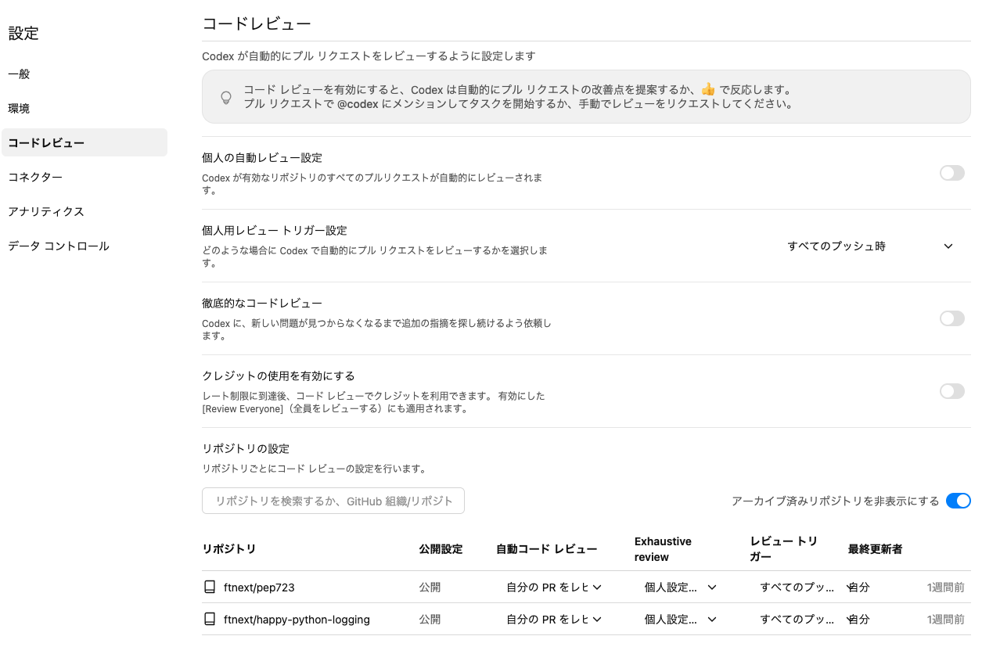
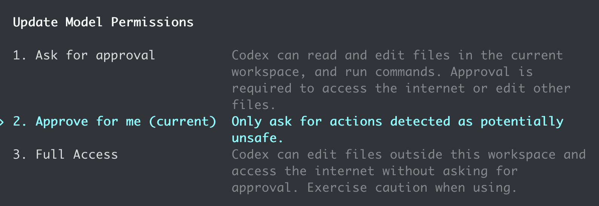

:ogp_title: わたしの、最高の相棒、Codex
:ogp_event_name: codex-findy
:ogp_slide_name: my-best-partner-codex-app
:ogp_description: 開発フローの中で活かすCodex - 実践者3名が語る使いどころと改善
:ogp_image_name: codex-findy2

==================================================
わたしの、最高の相棒、Codex
==================================================

わたしの、最高の **相棒**、Codex
==================================================

自動レビュー、モバイル、App Server

:Event: 開発フローの中で活かすCodex ``#codex_findy``
:Presented: 2026/06/04 nikkie（スペース連打 or 矢印キーでめくります）

*It's time to fly* [#codex-brand-movie-nba]_
==================================================

.. raw:: html

    <iframe width="560" height="315" src="https://www.youtube-nocookie.com/embed/bJcA23ckzcY?si=ic7hHrVxJDQehIhh" title="YouTube video player" frameborder="0" allow="accelerometer; autoplay; clipboard-write; encrypted-media; gyroscope; picture-in-picture; web-share" referrerpolicy="strict-origin-when-cross-origin" allowfullscreen></iframe>

.. [#codex-brand-movie-nba] `OpenAIは今夜のNBAファイナル第1戦でこのブランドムービーを流すそうです <https://x.com/thsottiaux/status/2062310660806205901>`__

お前、誰よ [#omae-dareyo]_
==================================================

* nikkie（にっきー）・Python歴8年・`Codex Ambassador (Tokyo) <https://nikkie-ftnext.hatenablog.com/entry/announcement-one-of-codex-ambassadors-tokyo>`__
* 機械学習エンジニア（`We're hiring! <https://hrmos.co/pages/uzabase/jobs/1829077236709650481>`__）・`Speeda AI Agent <https://www.uzabase.com/jp/info/20250901/>`__ 開発（`A2A提供 <https://jp.ub-speeda.com/news/20260319/>`__）

.. image:: ../_static/uzabase-white-logo.png

.. [#omae-dareyo] Pythonコミュニティにおける自己紹介のことです

3月 [#codex-findy-march]_ にもお話ししました
------------------------------------------------------------

.. raw:: html

    <iframe width="800" height="480" src="https://ftnext.github.io/2026-slides/codex-findy/my-best-partner-codex-cli.html#/1"
        title="わたしの、最高の相棒、Codex CLI"></iframe>

.. [#codex-findy-march] アーカイブ https://findy-code.io/events/VL_rdU3iJcEoP

おことわり
------------------------------------------------------------

* Codexの利用事例は、私の **個人開発から** が中心です
* ユーザベースのSpeeda開発チームは *常時ペアプログラミング* で開発しています [#uzabase-pair-programming]_ 。featureブランチでプルリクエストはありません

.. [#uzabase-pair-programming] `僕らのペアプログラミングにはまだ伸びしろがある ─ ペアプロガイドラインを策定したユーザベースはどんなペアプロをしているのか？ <https://agilejourney.uzabase.com/entry/2025/01/24/103000>`__

3月からの差分：**Codex App** [#why-app]_
==================================================

.. image:: ../_static/codex-findy/app-screenshot-light.webp
    :alt: https://developers.openai.com/images/codex/app/app-screenshot-light.webp
    :target: https://developers.openai.com/codex/app

.. [#why-app] 理解していなくても `git worktreeが簡単に使えた <https://developers.openai.com/codex/app/worktrees>`__ り、並列作業が管理しやすかったりで乗り換え

Codexの提供形態 [#codex-quickstart-doc]_ (私の利用量)
------------------------------------------------------------

* **App** (多) 👈おすすめ
* CLI (少)
* Cloud (多)
* VS Codeなどの拡張 (少)

.. [#codex-quickstart-doc] https://developers.openai.com/codex/quickstart#setup

Appって何ができるの？ ー おすすめ動画 [#findy-kyohei-san]_
------------------------------------------------------------

.. raw:: html

    <iframe width="560" height="315" src="https://www.youtube-nocookie.com/embed/LoX9_dnXthc?si=pzwvD_FUClL1bzcg" title="YouTube video player" frameborder="0" allow="accelerometer; autoplay; clipboard-write; encrypted-media; gyroscope; picture-in-picture; web-share" referrerpolicy="strict-origin-when-cross-origin" allowfullscreen></iframe>

.. [#findy-kyohei-san] `オレオレ神関数のOSS化で人生が変わった。pdfme開発者 kyoheiさんがOSS活動に取り組む理由 <https://findy-code.io/engineer-lab/pdfme>`__

イチオシ機能：**ペット** と一緒 [#codex-pet-blog]_ 🏃‍♂️
------------------------------------------------------------

.. raw:: html

    <blockquote class="twitter-tweet" data-lang="ja" data-align="center" data-dnt="true">
Pets. Now in Codex.  Use /pet to wake your pet. <a href="https://t.co/aAm4lLP4LW">pic.twitter.com/aAm4lLP4LW</a>
&mdash; OpenAI Developers (@OpenAIDevs) <a href="https://x.com/OpenAIDevs/status/2050275713824211041?ref_src=twsrc%5Etfw">2026年5月1日</a></blockquote> 

.. [#codex-pet-blog] 拙ブログ `Codex App で"ペットが飼える"ようになったと聞きまして <https://nikkie-ftnext.hatenablog.com/entry/codex-app-pet-feature-hatch-pet-skill-realize-my-idol>`__

本題へ：開発フローの中で活かすCodex (IMO [#ambassador-disclaimer]_)
======================================================================

* コードレビュー
* 実装
* コードリーディング
* 開発ワークフロー

.. [#ambassador-disclaimer] Codex Ambassadorといっても私はめちゃめちゃ知っているわけではありません。紹介されなかったけどこれが便利というものがある方はぜひ発信を🙏（拡散します）

コードレビュー [#why-ai-review]_
==================================================

`ひとつのことを極め抜け <https://kimetsu.com/anime/story/detail/?ep=17&series=risshi>`__ ⚡️

1. Codex Cloud
2. ローカルでの開発

.. [#why-ai-review] AIが生産するコードを全部見切れないので、人間が見る箇所を可能な限り減らしたくて取り組んでます

OpenAIはCodexでコードレビュー [#example-codex-github]_
------------------------------------------------------------

    Every pull request at OpenAI is now reviewed by Codex before human eyes see it,

https://x.com/lennysan/status/2022121036364529702 (2026/02)

.. [#example-codex-github] 例：https://github.com/openai/codex/pulls chatgpt-codex-connector[bot]

.. _Codex code review in GitHub: https://developers.openai.com/codex/integrations/github

`Codex code review in GitHub`_
==================================================

* Codex Cloudは **簡単** にGitHubと連携設定できます
* 私の設定：PRにpushされるたびにコードレビュー
* 本当に頼りにしています（例：GitHub Actionsのセキュリティ面）

設定例（画像クリックで設定画面へ）
------------------------------------------------------------

Codex Cloud のコードレビューのここが推し！
------------------------------------------------------------

* 差分を読むだけにあらず
* `Cloudの環境を使って <https://chatgpt.com/codex/cloud?tab=code_reviews>`__ **コマンド実行**。仮説を持ったコードレビュー
* この動画の受け売り：`Automatic code reviews with OpenAI Codex <https://youtu.be/HwbSWVg5Ln4?si=v4gCsn58o9nMh0fF&t=168>`__

自動コードレビュー ✖️ PRの面倒
------------------------------------------------------------

* ``/autofix-pr`` (Claude Code on the web)（`プルリクエストの自動修正 <https://code.claude.com/docs/ja/claude-code-on-the-web#%E3%83%97%E3%83%AB%E3%83%AA%E3%82%AF%E3%82%A8%E3%82%B9%E3%83%88%E3%81%AE%E8%87%AA%E5%8B%95%E4%BF%AE%E6%AD%A3>`__） [#codex-claude-loop-blog]_
* Devin

.. [#codex-claude-loop-blog] 拙ブログ `Claude Code on the web の auto-fix × Codex cloud の PR レビュー で pull request を自動修正 <https://nikkie-ftnext.hatenablog.com/entry/claude-code-on-the-web-auto-fix-codex-cloud-github-integration-review-loop>`__

ローカルのCodex {CLI,App}
==================================================

* ``/review`` （``/コードレビュー``）
* ``codex review``

現在の差分やブランチをレビューできる

.. TODO 仕組みの情報を追加したい
    https://github.com/openai/codex/blob/rust-v0.136.0/codex-rs/core/review_prompt.md

Codex以外でも（Cursor、VS Code）
------------------------------------------------------------

* CursorのComposer 2.5で実装
* コードレビュー目的で私は **新規セッションでGPTを呼び出す**
* plan(Opus 4.8)、実装(Composer 2.5)、コードレビュー(GPT-5.5)と切り替えるのを試し中

.. _Codex plugin for Claude Code: https://github.com/openai/codex-plugin-cc

ローカル開発で `Codex plugin for Claude Code`_
------------------------------------------------------------

* OpenAIによるClaude Codeプラグイン
* **Claude CodeからCodexを呼び出せる** （スキルやフックを提供）
* 例：Claude CodeがStopするとCodexがコードレビュー（``/codex:setup --enable-review-gate``）

Codexのコードレビューを極め抜け
==================================================

* Codex CloudでGitHubのプルリクレビュー設定はおすすめ
* ローカルでの開発でも、Codex(GPT)のコードレビューを求めに行く [#goal-review-gate-idea]_

.. [#goal-review-gate-idea] ``/goal`` でもコードレビューゲートのような動きはできてそう

🔖開発フローの中で活かすCodex
------------------------------------------------------------

* コードレビュー
* **実装**
* コードリーディング
* 開発ワークフロー

.. _自動レビュー: https://developers.openai.com/codex/concepts/sandboxing/auto-review

`自動レビュー`_
==================================================

* Codexが **実装** するのを大きくサポート
* コマンド実行の *許可を求めてこなくなる*
* プルリクエストや差分の **コードレビューではない** です

Codex App「代理で承認」（旧称 自動レビュー）
------------------------------------------------------------

.. raw:: html

    <blockquote class="twitter-tweet" data-lang="ja" data-align="center" data-dnt="true">
Auto-review is a new mode that lets Codex work longer with fewer approvals and safer execution.  It helps Codex keep moving through tests, builds, and more, including during long tasks and automations, while a separate agent checks higher-risk steps in context before they run. <a href="https://t.co/TCcNC5yB0H">pic.twitter.com/TCcNC5yB0H</a>
&mdash; OpenAI Developers (@OpenAIDevs) <a href="https://x.com/OpenAIDevs/status/2047436655863464011?ref_src=twsrc%5Etfw">2026年4月23日</a></blockquote>

Codex CLIは ``/permissions``
------------------------------------------------------------

codex-cli 0.136.0-alpha.2

自走例
------------------------------------------------------------

* Opus 4.7(high)と `superpowers <https://claude.com/plugins/superpowers>`__ で長大な計画（4000行）を作った
* GPT-5.5(高)とsuperpowersで実装（Codex Appの自動レビュー）
* 実装が終わるまでの **2時間**、人間にコマンド実行許可を求めて止まることがなかった

自動レビューは何をするのか
------------------------------------------------------------

* LLMがコマンドの **実行許可を人間の代わりに** 見てくれる [#auto-review-reject-example]_
* サブエージェント + プロンプトによる実装（``guardian_approval``）

.. [#auto-review-reject-example] トランクベース開発と伝えていないメインブランチpushは弾かれました

.. revealjs-break::
    :notitle:

.. raw:: html

    <blockquote class="twitter-tweet" data-lang="ja" data-align="center" data-dnt="true">
Codex Appの自動レビューにめちゃめちゃ助けられていて、でもこれって企業秘密っぽいよなーと思ってましたが、なんと仕組み公開されてました。 プロンプトで判定させてるだけ、パクれる！！<a href="https://t.co/ASkqHfswHq">https://t.co/ASkqHfswHq</a> App Serverもサポートしているみたいで、Codex Appに限らず使えそう。ありがたい限り
&mdash; nikkie(にっきー) / にっP (@ftnext) <a href="https://x.com/ftnext/status/2059055723657809960?ref_src=twsrc%5Etfw">2026年5月25日</a></blockquote>

.. TODO 仕組みをのぞいたネタが追加できそう

参考：同様の機能の流れ
------------------------------------------------------------

* Claude Code `auto mode <https://code.claude.com/docs/ja/auto-mode-config>`__
* Cursor (3.6) `Auto-review Run Mode <https://cursor.com/ja/docs/agent/tools/terminal#auto-review>`__

コーディングエージェント自走が圧倒的に簡単に
------------------------------------------------------------

.. raw:: html

    <iframe class="speakerdeck-iframe" style="border: 0px; background: rgba(0, 0, 0, 0.1) padding-box; margin: 0px; padding: 0px; border-radius: 6px; box-shadow: rgba(0, 0, 0, 0.2) 0px 5px 40px; width: 100%; height: auto; aspect-ratio: 560 / 315;" frameborder="0" src="https://speakerdeck.com/player/6f8da4e8af70435693f4fdd940e956e4?slide=3" title="夜を制する者が “AI Agent 大民主化時代” を制する" allowfullscreen="true" allow="web-share" data-ratio="1.7777777777777777"></iframe>

2026年最高の発明、自動レビュー
==================================================

* Codex {App,CLI}（や他のコーディングエージェント）でぜひ設定しましょう
* 仕組み：LLMにプロンプトで **代理承認** させています

**CM**：導入するなら
------------------------------------------------------------

.. raw:: html

    <blockquote class="twitter-tweet" data-lang="ja" data-align="center" data-dnt="true">
Want to (officially) use Codex at work?  Send this post to your CTO to bring your team to Codex. Eligible enterprise customers who switch in the next 30 days get 2 free months of Codex usage for new users. <a href="https://t.co/38e8y7MAmg">pic.twitter.com/38e8y7MAmg</a>
&mdash; OpenAI Developers (@OpenAIDevs) <a href="https://x.com/OpenAIDevs/status/2054586214112780518?ref_src=twsrc%5Etfw">2026年5月13日</a></blockquote>

🔖開発フローの中で活かすCodex
------------------------------------------------------------

* コードレビュー
* 実装
* **コードリーディング**
* 開発ワークフロー

コードリーディング
==================================================

* ChatGPTのモバイルアプリ使ってる方？🙋（私はiPhoneで）
* ChatGPTのモバイルアプリから、あなたの **PCのCodex Appに接続** できます [#codex-remote-connections-docs]_
* （Codex Cloudとは別の話 [#codex-cloud-source-reading]_ ）

.. [#codex-remote-connections-docs] https://developers.openai.com/codex/remote-connections

.. [#codex-cloud-source-reading] Codex Cloudでのコードリーディングは御しきれておらず、体験が私にはイマイチでした

.. revealjs-break::
    :notitle:

.. raw:: html

    <blockquote class="twitter-tweet" data-lang="ja" data-align="center" data-dnt="true">
You&#39;ve been asking for this one...  Now in preview: Codex in the ChatGPT mobile app.  Start new work, review outputs, steer execution, and approve next steps, all from the ChatGPT mobile app. Codex will keep running on your laptop, Mac mini, or devbox. <a href="https://t.co/9i2Jckjt9z">pic.twitter.com/9i2Jckjt9z</a>
&mdash; OpenAI (@OpenAI) <a href="https://x.com/OpenAI/status/2055016850849993072?ref_src=twsrc%5Etfw">2026年5月14日</a></blockquote>

元々Codexでソースコード読んでました
------------------------------------------------------------

.. raw:: html

    <iframe width="800" height="480" src="https://ftnext.github.io/2025-slides/lunchwithai-codex2/invincible-code-reading.html"
        title="Codex CLIで加速するコードリーディング"></iframe>

モバイルでCodex
------------------------------------------------------------

* 私はPCでCodex Appで常時作業
* スマホさえ持っていれば、PCにcloneしたコードについて質問して **PCが手元になくても** 回答を得られる

仕事中
------------------------------------------------------------

:通勤中: 投げておいた質問の回答を読みながら
:仕事中: 休憩時間に使ってるライブラリへのニッチな疑問を、モバイルから自宅のCodexに投げる

モバイルで超快適コードリーディング
==================================================

* **Codex AppにChatGPTモバイルアプリから接続** する設定をぜひ！
* ここでもポイントは「自動レビュー（代理で承認）」
* なおMacBookは画面ロックせず低電力モードで待機（*最適化の余地あり*）

🔖開発フローの中で活かすCodex
------------------------------------------------------------

* コードレビュー
* 実装
* コードリーディング
* **開発ワークフロー**

App Server
==================================================

Codexを使った *開発ワークフローをカスタマイズ* できる

**いろんな形態** で提供できる秘密
------------------------------------------------------------

* App
* CLI
* Cloud
* VS Code拡張

.. _Codex ハーネスの解放：App Server を構築した方法: https://openai.com/ja-JP/index/unlocking-the-codex-harness/

記事 `Codex ハーネスの解放：App Server を構築した方法`_
------------------------------------------------------------

* サーバとクライアント間の **JSON-RPC** プロトコル [#app-server-raw-json-rpc-blog]_
* 異なるクライアント（CLI、App、IDE拡張、...）が同じCodexハーネスを使用できる
* CLIで ``codex app-server`` したらサーバ起動

.. [#app-server-raw-json-rpc-blog] 拙ブログ `Codex App Server に Python SDK に代わって JSON-RPC を人力で送って Hello world <https://nikkie-ftnext.hatenablog.com/entry/codex-app-server-waits-json-rpc-from-stdin>`__

App Server **SDK** [#app-server-sdk-docs]_
------------------------------------------------------------

* TypeScript
* **Python** (NEW!!) `今週 <https://x.com/reach_vb/status/2061569472792572163>`__ 🔥

.. [#app-server-sdk-docs] https://developers.openai.com/codex/sdk

App Server SDK
------------------------------------------------------------

* npm `@openai/codex-sdk <https://www.npmjs.com/package/@openai/codex-sdk>`__ （例：`nrslib/takt <https://github.com/nrslib/takt/blob/v0.43.0/package.json#L67>`__ [#findy-nrslib-takt]_ ）
* PyPI `openai-codex <https://pypi.org/project/openai-codex/>`__

.. [#findy-nrslib-takt] `AIに疲れたプログラマが、OSSを始めるまで <https://findy-code.io/media/articles/codesidechat-nrslib>`__

実装例：Codexに実装&コードレビューさせる
------------------------------------------------------------

.. code-block:: console
    :caption: `review_loop_idea.py <https://github.com/ftnext/2026-slides/blob/main/samplecode/codex-sdk-example/review_loop_idea.py>`__

    % uv run review_loop_idea.py 
    Sample project: /.../codex-sdk-implementation-review-ayzpy2am
    Implementation/review CLI. Type /diff to show the current diff.
    Type /exit or /quit to stop.

    task> calculatorに冪乗を実装して

    Implementation:
    実装しました。

    Review cycle 1:
    Review summary: No actionable correctness, regression, missing-test, or unsafe-behavior issues found in the uncommitted changes. `PYTHONDONTWRITEBYTECODE=1 python -m unittest -v` passes.
    Review findings: none

ぜひ構築してみてください！
==================================================

* OpenAIによる `Python SDK Examples <https://github.com/openai/codex/tree/main/sdk/python/examples>`__
* nikkieまとめ `Awesome Codex App Server <https://posfie.com/@ftnext/p/SpkW6rS>`__ （更新中） 

まとめ🌯 わたしの、最高の相棒、Codex
==================================================

:自動レビュー: **自走** が簡単に（+定評あるコードレビュー）
:モバイル: スマホ片手にどこからでも **コードリーディング**
:App Server: **開発ワークフロー** も組める！

ご清聴ありがとうございました！
--------------------------------------------------

Happy Development♪

お知らせとAppendixが続きます

.. revealjs-break::
    :notitle:

.. raw:: html

    
    

      <h2>nikkieさんからのお知らせ（再現）</h2>

      <h3>会えるAmbassador(?)勉強会情報（かいつまんで紹介します）</h3>
      <ul>
        <li>6/16(火)<a href="https://lancersagent.connpass.com/event/391220/" target="_blank" rel="noopener">Claude Code、どこまで任せられる？失敗事例から任せ方を学ぶLT会（オンライン）</a> <strong>LTも募集中</strong></li>
        <li>6/23(火)<a href="https://syncable.connpass.com/event/395070/" target="_blank" rel="noopener">小規模開発のリアルを語ろう〜試行錯誤を持ち寄る会〜（渋谷）</a></li>
      </ul>

      <h3>皆さんのお近くを訪れるかも</h3>
      <ul>
        <li>6/5(金)<a href="https://lycorptech-fukuoka.connpass.com/event/392050/" target="_blank" rel="noopener">Python Meetup <strong>Fukuoka #7</strong></a></li>
        <li>6/28(日)<a href="https://kinoko.connpass.com/event/381321/" target="_blank" rel="noopener">きのこカンファレンス2026（6/28本編）</a></li>
        <li>7/18(土)<a href="https://startpython.connpass.com/event/391712/" target="_blank" rel="noopener">みんなのPython勉強会 in <strong>長野 #5</strong></a></li>
        <li>8/21(金)22(土)<a href="https://pyconjp.connpass.com/event/391006/" target="_blank" rel="noopener">PyCon JP 2026 (<strong>広島</strong>)</a></li>
      </ul>

      
近い将来Codex関係のイベント開催する時は、ぜひお越しください！

    

Appendix：開発フローの中でさらに活かすCodex
==================================================

* 調査
* 自動化

助けてCodexえもん〜
==================================================

* 落ちた GitHub Actions の調査
* ローカルPCから ``gh`` コマンドでworkflowのログを確認

自走して適切に修正
------------------------------------------------------------

:権限設定ミス解決: https://github.com/ftnext/agents-cli-source-mirror/commit/aa7f9d2063e84b47eecde7a37a85d919b5d32cae
:メジャーバージョンアップに伴う依存の更新: https://github.com/ftnext/adk-python-db-schema-history/commit/ea6bbb4a56e0c83730dee7a2fc01ad71c11ae30f

自動化
==================================================

* シェルスクリプトに秀でていると感じる

3月に話しました
------------------------------------------------------------

.. raw:: html

    <iframe width="800" height="480" src="https://ftnext.github.io/2026-slides/codex-findy/my-best-partner-codex-cli.html#/7/2"
        title="わたしの、最高の相棒、Codex CLI"></iframe>

直近ではLLMを使おうとしたら綺麗にシェルスクリプトに収められた
----------------------------------------------------------------------

* Claude Code Actionを使っていたが、「その必要ないです」とCodexがシェルスクリプトにした例
* https://github.com/ftnext/agents-cli-source-mirror/commit/6a50f60772c2b11782c113be69715a2e63392863

EOF
===
