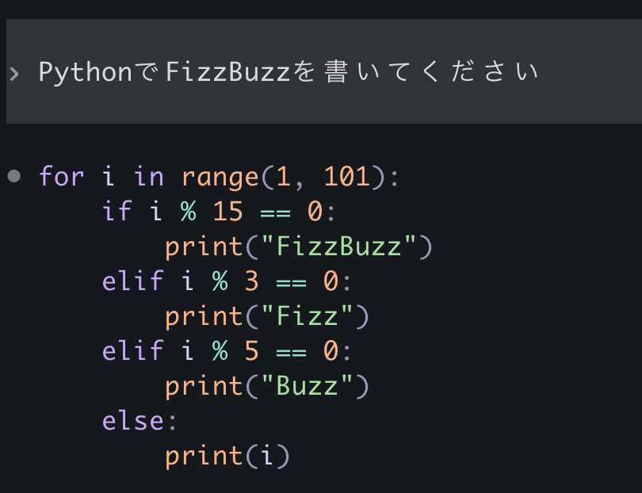
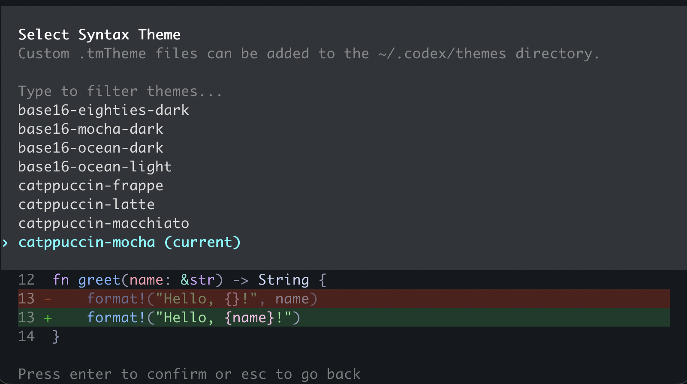
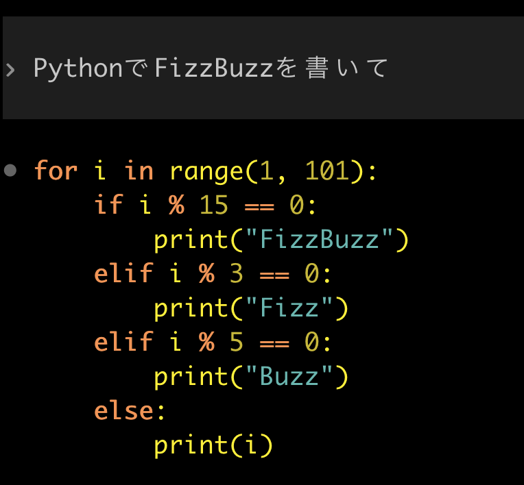
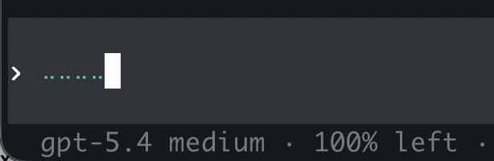
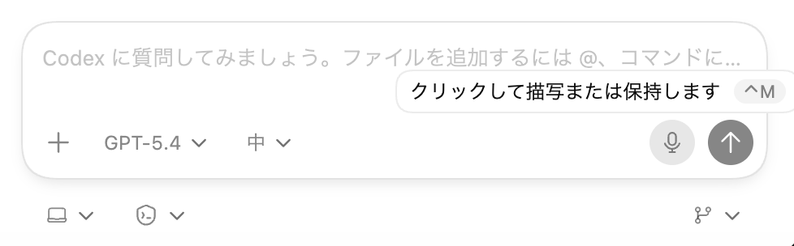

==================================================
Codex CLIで（を）ソースコードリーディング！
==================================================

Codex CLIで（を）ソースコードリーディング！
==================================================

あの機能はどうできている？

:Event: Codex Meetup Tokyo #1
:Presented: 2026/03/19 nikkie

Codexはソースが **公開** されている🤗
==================================================

https://github.com/openai/codex

Rust製

例えば Codex App
--------------------------------------------------

* :command:`codex app-server`
* JSON-RPCによるプロトコル（`Codex App Server <https://developers.openai.com/codex/app-server>`__） [#python-sdk-looking-forward]_

.. [#python-sdk-looking-forward] `Codex App Server Python SDK <https://github.com/openai/codex/tree/rust-v0.115.0/sdk/python>`__ 準備中。楽しみ！

CodexのソースコードをCodex {CLI,App}に解説してもらう日々
------------------------------------------------------------

その中から **小さな機能2つ** と、どう実装されているかを共有します

1️⃣シンタックスハイライト
==================================================

Codex CLIについて [#codex-app-highlight]_

https://developers.openai.com/codex/cli/features#syntax-highlighting-and-themes

.. [#codex-app-highlight] Codex Appも差分のコードに色ついてますね

.. revealjs-break::
    :notitle:

(GPT-5.4 medium effort)

.. _v0.105.0: https://github.com/openai/codex/releases/tag/rust-v0.105.0

`v0.105.0`_ にてシンタックスハイライト追加
--------------------------------------------------

    The TUI now syntax-highlights fenced code blocks and diffs, adds a /theme picker with live preview, and uses better theme-aware diff colors for light and dark terminals.

コードブロックや実行するコマンドが **劇的に読みやすく**

では、どう実装されている？
==================================================

.. https://nikkie-ftnext.hatenablog.com/entry/codex-cli-v0.105.0-syntax-highlight-by-syntect-minimum-clone-like-bat

* `feat(tui): syntax highlighting via syntect with theme picker #11447 <https://github.com/openai/codex/pull/11447>`__
* `syntect <https://github.com/trishume/syntect>`__
* ``cat`` cloneの :command:`bat` でも使われている

.. https://github.com/openai/codex/blob/rust-v0.115.0/codex-rs/tui/src/render/highlight.rs#L570

syntectを使った実装例 [#syntect-practice]_
--------------------------------------------------

.. code-block:: rust

    let syn_set = two_face::syntax::extra_newlines();
    let theme_set = two_face::theme::extra();

    let syn_ref = syn_set.find_syntax_by_extension("py").unwrap();
    let theme = &theme_set[two_face::theme::EmbeddedThemeName::CatppuccinMocha];
    let mut highlighter = syntect::easy::HighlightLines::new(syn_ref, theme);
    let lines = content.lines();
    let mut output = String::new();

    for line in lines {
        let ranges = highlighter.highlight_line(line, &syn_set).unwrap();
        let escaped = syntect::util::as_24_bit_terminal_escaped(&ranges[..], false);
        output.push_str(&escaped);
        output.push('\n');
    }

    print!("{}", output);

.. [#syntect-practice] https://github.com/ftnext/command-line-rust-book/tree/c1bc1e49fdf56464d9225fd6d4fafc9b8661f319/self-taught/codex-highlight

.. _two-face: https://github.com/CosmicHorrorDev/two-face

テーマは `two-face`_
--------------------------------------------------

.. https://github.com/openai/codex/blob/rust-v0.115.0/codex-rs/tui/src/render/highlight.rs#L136

カスタムテーマ
--------------------------------------------------

.. code-block:: xml
    :caption: `~/.codex/themes/sunset-aurora.tmTheme` (made by GPT-5.4)

    <?xml version="1.0" encoding="UTF-8"?>
    <!DOCTYPE plist PUBLIC "-//Apple//DTD PLIST 1.0//EN" "http://www.apple.com/DTDs/PropertyList-1.0.dtd">
    <plist version="1.0">
    <dict>
        <key>name</key>
        <string>Sunset Aurora</string>
        <key>settings</key>
        <array>
        <!-- Global -->
        <dict>
            <key>settings</key>
            <dict>
            <key>foreground</key><string>#fff03c</string>
            <key>background</key><string>#274079</string>
            <key>caret</key><string>#f19557</string>
            <key>selection</key><string>#7f6575</string>
            <key>lineHighlight</key><string>#6bb6b0</string>
            </dict>
        </dict>

        <!-- Comments -->
        <dict>
            <key>name</key><string>Comment</string>
            <key>scope</key><string>comment</string>
            <key>settings</key>
            <dict>
            <key>foreground</key><string>#c7b83c</string>
            <key>fontStyle</key><string>italic</string>
            </dict>
        </dict>

        <!-- Keywords -->
        <dict>
            <key>name</key><string>Keyword</string>
            <key>scope</key><string>keyword, storage.type</string>
            <key>settings</key>
            <dict>
            <key>foreground</key><string>#f19557</string>
            <key>fontStyle</key><string>bold</string>
            </dict>
        </dict>

        <!-- Strings -->
        <dict>
            <key>name</key><string>String</string>
            <key>scope</key><string>string</string>
            <key>settings</key>
            <dict>
            <key>foreground</key><string>#6bb6b0</string>
            </dict>
        </dict>

        <!-- Functions / Types -->
        <dict>
            <key>name</key><string>Function and Type Names</string>
            <key>scope</key><string>entity.name.function, entity.name.type</string>
            <key>settings</key>
            <dict>
            <key>foreground</key><string>#fff03c</string>
            </dict>
        </dict>

        <!-- Constants / Numbers -->
        <dict>
            <key>name</key><string>Constants</string>
            <key>scope</key><string>constant, constant.numeric</string>
            <key>settings</key>
            <dict>
            <key>foreground</key><string>#c7b83c</string>
            </dict>
        </dict>

        <!-- Invalid / Error -->
        <dict>
            <key>name</key><string>Invalid</string>
            <key>scope</key><string>invalid</string>
            <key>settings</key>
            <dict>
            <key>foreground</key><string>#274079</string>
            <key>background</key><string>#f19557</string>
            </dict>
        </dict>
        </array>
    </dict>
    </plist>

``/theme`` でカスタムテーマ選択
--------------------------------------------------

2️⃣音声入力
==================================================

Codex CLI（とCodex App）について

**半角スペース** を長押し（Codex CLI）
--------------------------------------------------

:kbd:`Ctrl+M` （Codex App, macOS）
--------------------------------------------------

:command:`codex features list`
--------------------------------------------------

.. code-block:: txt

    voice_transcription              under development  false

.. code-block:: txt

    % codex --version
    codex-cli 0.115.0

Codex CLIの設定を変える
--------------------------------------------------

.. https://developers.openai.com/codex/cli/features#feature-flags

.. code-block:: toml
    :caption: :file:`~/.codex/config.toml` を手で変更

    [features]
    voice_transcription = true

.. code-block:: shell
    :caption: コマンドで :file:`~/.codex/config.toml` を変更

    codex features enable voice_transcription

起動時に一時的に
--------------------------------------------------

.. code-block:: shell

    codex --enable voice_transcription
    codex -c features.voice_transcription=true

では、どう実装されている？ (Codex CLI)
==================================================

* APIキー認証の場合 `gpt-4o-mini-transcribe <https://developers.openai.com/api/docs/models/gpt-4o-mini-transcribe>`__
* ChatGPTアカウント認証の場合、/backend-api/transcribe へ

.. https://github.com/openai/codex/blob/rust-v0.115.0/codex-rs/tui/src/voice.rs#L789

promptパラメタでひと工夫
--------------------------------------------------

* https://developers.openai.com/api/docs/guides/speech-to-text#prompting
* 前方にあるテキスト（ユーザ入力）も音声と合わせてgpt-4o-mini-transcribeへ送る

メンテしている音声認識ライブラリでパクる [#thank-you-codex-half-year-pro-support]_
----------------------------------------------------------------------------------------------------

.. code-block:: python
    :caption: https://github.com/Uberi/speech_recognition/pull/881 のイメージ

    class SpacebarLiveTranscriber:
        def __init__(self) -> None:
            self._worker_thread = threading.Thread(target=self._transcription_worker, daemon=True)
            self._worker_thread.start()
        
        def _transcription_worker(self) -> None:
            while True:
                audio = sr.AudioData(frame_data, sample_rate, sample_width)
                return self.recognizer.recognize_openai(audio, model="gpt-4o-mini-transcribe").strip()

.. [#thank-you-codex-half-year-pro-support] `SpeechRecognition <https://github.com/Uberi/speech_recognition>`__ メンテナへの `サポート <https://x.com/OpenAIDevs/status/2029998202934677938>`__ に深く感謝申し上げます

まとめ🌯：あの機能はどうできている？
==================================================

* シンタックスハイライト：syntect（bat同様）、テーマはtwo-face
* 音声入力：gpt-4o-mini-transcribe、promptパラメタの工夫
* Codex CLIやCodex Appで気になるソースコードを読むのは、いいぞ

ご清聴ありがとうございました（最後に、お前、誰よ）
--------------------------------------------------

* nikkie（にっきー）・Python歴8年
* 機械学習エンジニア。 `Speeda AI Agent <https://jp.ub-speeda.com/news/speeda-promotion-gallery/>`__ 開発。 `A2A提供開始 <https://jp.ub-speeda.com/news/20260319/>`__ （`We're hiring! <https://hrmos.co/pages/uzabase/jobs/1829077236709650481>`__）

.. image:: ../_static/uzabase-white-logo.png
