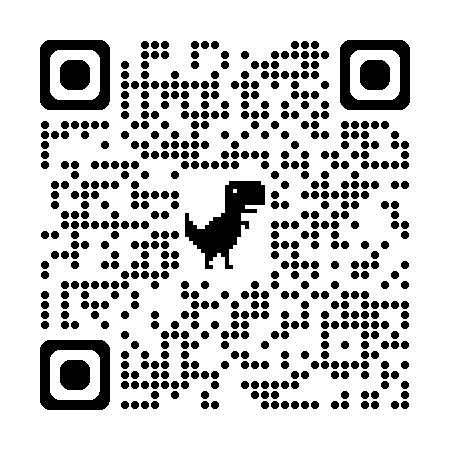

==================================================
Codexの ドキュメント 日本語化計画
==================================================

:Event: Codex Meetup Tokyo #2
:Presented: 2026/08/07 nikkie

https://codex-docs-ja.nikkie-ftnext.workers.dev/
==================================================

Codexのドキュメント日本語化計画
--------------------------------------------------

* Codexのドキュメントを **日本語化** しました
* **私が読む** ためのものです
* OpenAIさんが公式翻訳したら吹き飛びます

お前、誰よ
============================================================

* nikkie（にっきー）・`Codex Ambassador (Tokyo) <https://nikkie-ftnext.hatenablog.com/entry/announcement-one-of-codex-ambassadors-tokyo>`__・Devin Ambassador
* 機械学習エンジニア・`Speeda AI Agent <https://www.uzabase.com/jp/info/20250901/>`__ 開発（`A2A <https://jp.ub-speeda.com/news/20260319/>`__・`MCP <https://jp.ub-speeda.com/news/20260701/>`__ 提供）

.. image:: ../_static/uzabase-white-logo.png

Skill $openai-docs
============================================================

* 使ったことある方？
* OpenAIのAPIやCodexについて質問するとCodexが使う（ことが多い）

.. revealjs-break::
    :notitle:

.. raw:: html

    <blockquote class="twitter-tweet" data-lang="ja" data-align="center" data-dnt="true">
Codex Appだと$\openai-docs skillが最初から使える状態ではないかと思います<a href="https://t.co/iyckF7wvjs">https://t.co/iyckF7wvjs</a> これはClaude Codeのguide subagentと近い存在で、Codexのドキュメントのmarkdownを取得してCodexについて回答してくれます。OpenAI Developer Docs MCPも使うのでResponses APIなども知ってます <a href="https://t.co/dnD9j3SbSa">https://t.co/dnD9j3SbSa</a>
&mdash; nikkie(にっきー) / にっP (@ftnext) <a href="https://x.com/ftnext/status/2073774899328585787?ref_src=twsrc%5Etfw">2026年7月5日</a></blockquote> 

何が書いてある？
--------------------------------------------------

* https://github.com/openai/skills/blob/main/skills/.curated/openai-docs/SKILL.md
* `OpenAI developer docs MCP server <https://developers.openai.com/resources/docs-mcp/>`__
* Codexについては `scripts/fetch-codex-manual.mjs <https://github.com/openai/skills/blob/main/skills/.curated/openai-docs/scripts/fetch-codex-manual.mjs>`__

何を取得している？
--------------------------------------------------

* https://developers.openai.com/codex/codex-manual.md
* Codexの **ドキュメント（英語）を1つにまとめた** ファイル（発表時点1.9MB）
* GPTは全部入りのこれを見て回答できる

:file:`codex-manual.md`
============================================================

* `The /llms.txt file <https://llmstxt.org/>`__：LLM向けのWebサイト表現
* IMO：claude-code-guideと近いものを実現してますよね

思い出した先行例
--------------------------------------------------

.. raw:: html

    <iframe class="speakerdeck-iframe" style="border: 0px; background: padding-box rgba(0, 0, 0, 0.1); margin: 0px; padding: 0px; border-radius: 6px; box-shadow: rgba(0, 0, 0, 0.2) 0px 5px 40px; width: 100%; height: auto; aspect-ratio: 560 / 315;" frameborder="0" src="https://speakerdeck.com/player/e0bf5acebba944ecaf6c10f3fe04d1f7?slide=13" title="Claude Codeをどのように キャッチアップしているか" allowfullscreen="true" allow="web-share" data-ratio="1.7777777777777777"></iframe>

.. _oikon48/cc-doc-tracker: https://github.com/oikon48/cc-doc-tracker

`oikon48/cc-doc-tracker`_
--------------------------------------------------

* Oikonさんによる、Claudeのドキュメントの **トラッカー**
* :file:`codex-manual.md` （やリンク先）についてパクった
* Build WeekにGPT-5.6 Sol(中)にやってもらいました

日本語翻訳
============================================================

* なぜなら **私が読みたい** から！通読したい
* GPTには不要。英語の :file:`codex-manual.md` や他のドキュメントを読んで日本語で回答できる

Lunaで日英翻訳
--------------------------------------------------

* APIキーを使ってLunaで日本語翻訳するPythonスクリプト
* Solに翻訳の様子を監督させる（現在150ドキュメント）
* 眺めてみましょう https://codex-docs-ja.nikkie-ftnext.workers.dev/

まとめ🌯：Codexのドキュメント日本語化計画
============================================================

* :file:`codex-manual.md` をトラックする仕組みを作りました
* 手元にドキュメントの英語マークダウンを得たのでLunaで日本語翻訳しました
* 読む同士がいたらお気づきの点は `discussions <https://github.com/ftnext/codex-docs-ja-discussions>`__ へどうぞ

ご清聴ありがとうございました
------------------------------------------------------------

Build Weekは力尽きたので、今回発表の場をありがとうございます！
