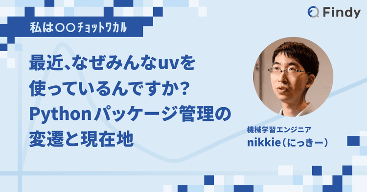

================================================================================
Pythonチュートリアル、venv を作って pip install と2026年も教え続けますか？
================================================================================

Pythonチュートリアル、venv を作って pip install と2026年も教え続けますか？
================================================================================

:Event: PyCon JP 2026 ``#pyconjpB``
:Presented: 2026/8/21 nikkie

**意見を集める** 時間です！
--------------------------------------------------

* PyCon JP 2026のプログラムは「`対話と交流 <https://techplay.jp/column/2127>`__」
* `Code of Conduct 行動規範 <https://2026.pycon.jp/ja/coc>`__ を守って楽しく *決闘*
* 各位の技術的な選択に **敬意** を

Python公式チュートリアルより
==================================================

.. code-block:: console
    :caption: `12. 仮想環境とパッケージ <https://docs.python.org/ja/3/tutorial/venv.html>`__

    $ python3.14 -m venv .venv
    $ source .venv/bin/activate
    (.venv) $ python -m pip install httpx2

2026年時点でも最適な一歩目？
--------------------------------------------------

* 議論ポイント：最初に教えるときに「venv を作って pip install」を選択しますか？
* `Python Boot Camp <https://pycamp.pycon.jp/textbook/7_scraping.html>`__ でやりたいのは、パッケージ（requests）を使ったWeb API呼び出し
* ``#pyconjpB`` でツイート推奨

お前、誰よ
============================================================

* nikkie（にっきー） [#nikkie-uuid]_ ・`Codex Ambassador (Tokyo) <https://nikkie-ftnext.hatenablog.com/entry/announcement-one-of-codex-ambassadors-tokyo>`__・`Devin Ambassador <https://x.com/ftnext/status/2069459222040105357>`__
* 機械学習エンジニア・`Speeda AI Agent <https://www.uzabase.com/jp/info/20250901/>`__ 開発（`A2A <https://jp.ub-speeda.com/news/20260319/>`__・`MCP <https://jp.ub-speeda.com/news/20260701/>`__ 提供）

.. [#nikkie-uuid] UUID `28fb3f96-a221-462c-93bd-567b431715b9 <https://x.com/ftnext/status/2041119610368602138>`__

「venvはもはや必須科目ではない」
------------------------------------------------------------

IMO：Pythonの こんなチュートリアルはどうだい？
------------------------------------------------------------

* uv導入 [#nikkie-uv-impression]_。 **uvでPythonをインストール**
* Pythonの文法説明
* **仮想環境を省略**。スクリプトは後述する *inline script metadata* で実行（``uv run script.py``）

.. [#nikkie-uv-impression] チュートリアルにuvを推しますが、私はuvに満足していません。むしろAstralに伝えたいことは山ほどあります（インタビュー記事や廊下でどうぞ）

メッセージ「仮想環境を ツールに任せて楽してこーぜ」
------------------------------------------------------------

* Pythonの仮想環境は変わらず必要
* 仮想環境を **どう管理するか** は再考の余地がある
* パッケージを使う最初の一歩をどう案内するか、ここに参加者の皆さんと **集合知**

目次：Pythonチュートリアル、venv を作って pip install と2026年も教え続けますか？
================================================================================

1. 仮想環境はなぜ必要か
2. 仮想環境の管理方法（人力 or ツール）
3. ひろがる、ツールで仮想環境管理
4. 2026年で考えたいトピック

.. include:: why-virtual-environment-needed.rst.txt

.. include:: virtual-environment-management.rst.txt

.. include:: bye-human-managed-virtual-environments.rst.txt

.. include:: topics-2026.rst.txt

まとめ🌯：Pythonチュートリアル、venv を作って pip install と2026年も教え続けますか？
==========================================================================================

* 私の立場は「**否** （＝教え続けない）」
* uvでPythonを入れ、inline script metadataで仮想環境を初回は飛ばす（ただしcooldownは伝える）

仮想環境の扱い方は **少しずつよくなって** きた
------------------------------------------------------------

* uvは仮想環境を「`正しい使い方を簡単に、誤った使い方を困難に <https://yoshi389111.github.io/kinokobooks/prog_ja/prog053.htm>`__」した（+爆速 & ワンストップ）
* 10年前は人力全盛だったが、ツールが進化した今、人力以外の選択肢がある
* **仮想環境の抽象化・カプセル化**：仕組みを詳しく知らなくても使える

Pythonで仕事をしている方は
------------------------------------------------------------

* どこかの段階で **仮想環境を理解するのをおすすめ** （それは最初でなくていい）
* Python処理系がどう動くのか知っている範囲を広げられる。結果、エンジニアとして解ける課題が広がる
* このトークをきっかけにしてもいいかもしれませんね

.. TODO 文献リスト？

ご清聴ありがとうございました
------------------------------------------------------------

あなただったら、venv を作って pip install と教えますか？
