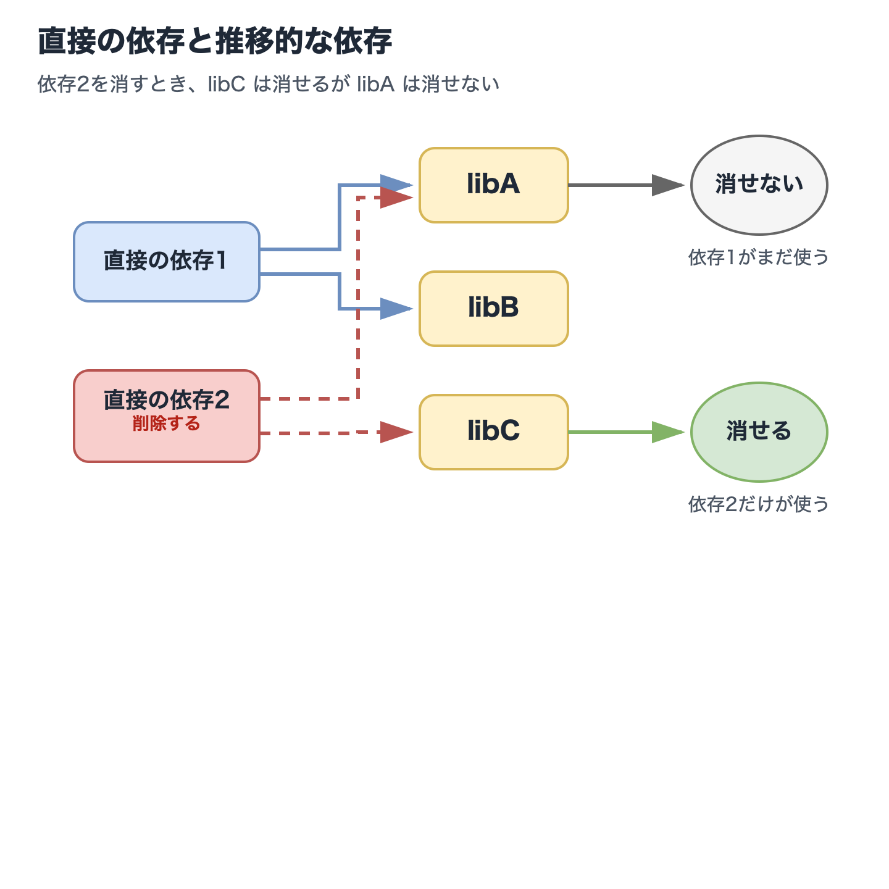
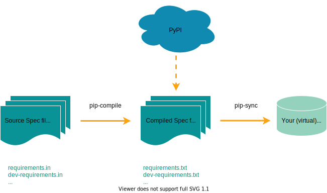

==========================================================================================
Breaking Free from Virtual Environments: A New Python Paradigm for 2026
==========================================================================================

Breaking Free from Virtual Environments: A New Python Paradigm for 2026
==========================================================================================

:Event: PythonAsia 2026
:Presented: 2026/03/22 nikkie

.. 1. 導入（3分）

Hello, PythonAsia! (Who are you?)
==============================================================

* Machine learning engineer in Tokyo. Developing `Speeda AI Agent <https://jp.ub-speeda.com/news/speeda-promotion-gallery/>`__ (with `A2A <https://jp.ub-speeda.com/news/20260319/>`__) [#uzabase-south-asia-news]_
* :fab:`github` `@ftnext <https://github.com/ftnext>`__ `SpeechRecognition <https://github.com/Uberi/speech_recognition>`__ (9k⭐️) maintainer

.. Sharing knowledge from work and OSS Python development at PyCon

.. image:: ../_static/uzabase-white-logo.png

.. [#uzabase-south-asia-news] `Acquisition of Sealed Network <https://uzabaseglobal.com/press-release/uzabase-expands-southeast-asia-expert-network-with-acquisition-of-sealed-network>`__

What is something developers used to manage themselves all the time, but hardly manage anymore?
==============================================================================================================

.. PyCon JPのプロポーザル確認（あと東海、静岡？）

The answer is **virtual environments**
------------------------------------------------------------

Are you still managing virtual environments by hand? 🙋

.. I almost never do. Those who raised their hands have a lot to take home from this talk.

Developers no longer need to manage virtual environments
------------------------------------------------------------

.. - Preview of this paradigm shift

* Various Python project management tools
* CLI execution using *temporary virtual environments*
* *inline script metadata* (PEP 723)

BREAKING NEWS!!
------------------------------------------------------------

.. Not sure how long today's conclusion will hold, but I'll present what I prepared.

.. raw:: html

    <blockquote class="twitter-tweet" data-lang="en" data-align="center" data-dnt="true">
We&#39;ve reached an agreement to acquire Astral.  After we close, OpenAI plans for <a href="https://twitter.com/astral_sh?ref_src=twsrc%5Etfw">@astral_sh</a> to join our Codex team, with a continued focus on building great tools and advancing the shared mission of making developers more productive.<a href="https://t.co/V0rDo0G8h9">https://t.co/V0rDo0G8h9</a>
&mdash; OpenAI Newsroom (@OpenAINewsroom) <a href="https://twitter.com/OpenAINewsroom/status/2034616934671724639?ref_src=twsrc%5Etfw">2026年3月19日</a></blockquote> 

Breaking Free from Virtual Environments: Agenda
==============================================================

1. Virtual Environment Basics
2. The Pain of Manual Virtual Environment Management
3. Evolution of Solutions (Main Part)

Solutions Available as of 2026
------------------------------------------------------------

1. CLI execution using *temporary virtual environments*
2. *inline script metadata* (PEP 723)

.. 2. 仮想環境の基礎（3分）

1️⃣ Virtual Environment Basics
==============================================================

Why do we (Python developers) need virtual environments?

From the Python Tutorial
------------------------------------------------------------

.. Traditional workflow: create, activate, install, use

.. code-block:: shell

    $ python -m venv .venv --upgrade-deps
    $ source .venv/bin/activate
    (.venv) $ python -m pip install sampleproject

`12.2. Creating Virtual Environments (The Python Tutorial) <https://docs.python.org/3/tutorial/venv.html#creating-virtual-environments>`__

.. A common directory location for a virtual environment is .venv.
    https://nikkie-ftnext.hatenablog.com/entry/python-venv-directory-name-202404

A virtual environment is a **directory**
------------------------------------------------------------

.. code-block:: shell

    % python -m venv --help
    usage: venv ENV_DIR [ENV_DIR ...]

.. code-block:: shell
    :caption: A directory called :file:`.venv/` has been created

    % ls -al
    drwxr-xr-x@  7 nikkie  staff  224 Mar 20 12:42 .venv

.. - A brief review of what a virtual environment is and why it was needed in Python

Why create a directory?
------------------------------------------------------------

* To serve as the installation destination for **third-party libraries**
* Without a virtual environment, there is only one installation location on the machine

.. TODO 図解を考える

What's inside :file:`.venv/`? [#python314-easter-egg]_
------------------------------------------------------------

.. tree -L 2 .venv を加工

.. code-block:: txt
    :caption: Installed on macOS from python.org
    :emphasize-lines: 2,7,11-12

    .venv
    ├── bin
    │   ├── activate
    │   ├── pip
    │   ├── pip3
    │   ├── pip3.14
    │   ├── python -> python3.14
    │   ├── python3 -> python3.14
    │   ├── python3.14 -> /Library/Frameworks/Python.framework/Versions/3.14/bin/python3.14
    │   └── 𝜋thon -> python3.14
    ├── lib
    │   └── python3.14/
    └── pyvenv.cfg

.. [#python314-easter-egg] easter egg: 𝜋thon https://github.com/python/cpython/pull/125035

:file:`.venv/bin/python`
------------------------------------------------------------

* A **symbolic link** to the Python interpreter installed on your machine
* The :file:`activate` script updates the ``PATH`` environment variable so this interpreter is found
* The interpreter and standard library use this path

:file:`.venv/lib/python3.14/site-packages/`
------------------------------------------------------------

* The directory where third-party libraries are installed
* Separated per virtual environment, so **different versions can coexist**

.. python -m site shows the standard library + third-party libraries in the virtual environment

.. 3. 手動管理のつらさ（4分）

2️⃣ We Are the Virtual Environment Management Tool
==============================================================

.. code-block:: shell

    $ python -m venv .venv --upgrade-deps
    $ source .venv/bin/activate
    (.venv) $ python -m pip install sampleproject

Let's list the pains of manual management (4 in total)

.. - How these problems affect productivity

Reproducing a virtual environment: ``pip freeze``
------------------------------------------------------------

.. code-block:: shell

    (.venv) $ python -m pip freeze > requirements.txt

.. code-block:: shell

    $ python -m venv recreate-env --upgrade-deps
    $ source recreate-env/bin/activate
    (recreate-env) $ python -m pip install -r requirements.txt

`12.3. Managing Packages with pip (The Python Tutorial) <https://docs.python.org/3/tutorial/venv.html#managing-packages-with-pip>`__

There are two types of dependencies
------------------------------------------------------------

.. code-block:: shell
    :caption: Direct dependencies

    (.venv) $ % python -m pip install httpx

.. code-block:: shell
    :caption: Transitive dependencies
    :emphasize-lines: 2-5,7

    (.venv) $ python -m pip freeze
    anyio==4.12.1
    certifi==2026.2.25
    h11==0.16.0
    httpcore==1.0.9
    httpx==0.28.1
    idna==3.11

Problem 1: ``pip freeze`` output is hard to manage
------------------------------------------------------------

* Both direct and transitive dependencies are combined into a single :file:`requirements.txt`
* If extras were specified for direct dependencies [#specify-extra-install]_, **extra information is lost** in :file:`requirements.txt`

.. [#specify-extra-install] Example: ``python -m pip install SpeechRecognition[audio]``

.. Rather than outputting the current virtual environment state as the source of truth, shouldn't the combination of libraries be the source of truth?

Problem 2: Hard to uninstall specific packages
------------------------------------------------------------

* When removing a direct dependency, **removing transitive dependencies** is difficult
* Direct dependency 1 depends on libA and libB
* Direct dependency 2 depends on libA and libC

.. Direct and transitive dependencies
    When removing dependency 2, libC can be removed, but libA cannot

.. revealjs-break::
    :notitle:

Problem 3: Virtual environments proliferate per script
------------------------------------------------------------

* Just want to quickstart a library, but a new virtual environment must be created each time

.. code-block:: txt
    :caption: Many directories like this

    .
    ├── .venv/
    └── script.py

Problem 4: Linters and formatters installed in every virtual environment
------------------------------------------------------------------------------------------

* CLIs used during development must be installed **in every virtual environment**
* Keeping them up to date across all projects is tedious

Our Pain as Virtual Environment Managers
------------------------------------------------------------

1. ``pip freeze`` lumps direct and transitive together
2. Can we remove transitive when removing direct?
3. Too many virtual environments for scripts
4. Installing and updating CLIs in every virtual environment

.. 4. 解決策の進化（5分）

3️⃣ How the Community Has Addressed These Problems
==============================================================

.. TODO It would be good to structure this so the approach to each problem is clear

1. ``pip freeze`` lumps direct and transitive together
2. Can we remove transitive when removing direct?
3. Too many virtual environments for scripts
4. Installing and updating CLIs in every virtual environment

.. _pip-tools: https://github.com/jazzband/pip-tools

`pip-tools`_
------------------------------------------------------------

* In place of ``pip freeze``: :command:`pip-compile` & :command:`pip-sync` [#pip-tools-overview-reference]_

.. [#pip-tools-overview-reference] https://github.com/jazzband/pip-tools/blob/v7.5.3/img/pip-tools-overview.svg

pip-tools workflow
------------------------------------------------------------

.. code-block:: txt
    :caption: Write direct dependencies in :file:`requirements.in`

    httpx

Problem 1: direct and transitive lumped together — solved

.. revealjs-break::

.. code-block:: txt
    :caption: :command:`pip-compile` generates :file:`requirements.txt` (direct & transitive)

    anyio==4.12.1
        # via httpx
    certifi==2026.2.25
        # via
        #   httpcore
        #   httpx
    h11==0.16.0
        # via httpcore
    httpcore==1.0.9
        # via httpx
    httpx==0.28.1
        # via -r requirements.in
    idna==3.11
        # via
        #   anyio
        #   httpx

.. revealjs-break::

* Use :command:`pip-sync` to sync the virtual environment to :file:`requirements.txt`
* **Change direct dependencies** in :file:`requirements.in` to update both :file:`requirements.txt` and the virtual environment (Problem 2 solved)

.. _Poetry: https://github.com/python-poetry/poetry

`Poetry`_
------------------------------------------------------------

.. - Poetry's approach: per-project virtual environment management

.. code-block:: shell
    :caption: Specify direct dependencies (= approach to Problems 1 & 2)

    $ poetry new
    $ poetry add httpx
    $ ls
    poetry.lock     pyproject.toml

Even less awareness of virtual environments [#poetry-uses-project-venv]_
------------------------------------------------------------------------------------------

.. code-block:: shell
    :caption: Just prefix commands with ``poetry run`` to run in the virtual environment

    $ poetry run python -m pip freeze

* Widely adopted for Python project development (around 2020) [#poetry-alternative-pipenv]_

.. [#poetry-uses-project-venv] `use the {project-dir}/.venv directory if one already exists. <https://python-poetry.org/docs/configuration/#virtualenvsin-project>`__

.. [#poetry-alternative-pipenv] `Pipenv <https://github.com/pypa/pipenv>`__ was also widely adopted for Python project development

.. _Rye: https://github.com/astral-sh/rye

`Rye`_ [#rye-sunset]_
------------------------------------------------------------

.. - The emergence of Rye and its influence on uv

* Written in Rust (faster than Python-based tools)
* **Python version management** + virtual environment management

.. code-block:: shell
    :caption: https://rye.astral.sh/guide/basics/ [#rye-interesting-point]_

    $ rye init
    $ rye add httpx
    $ rye sync

.. [#rye-sunset] Created by mitsuhiko, transferred to Astral, then archived in February 2026. Thank you for the great work.

.. [#rye-interesting-point] It was technically interesting that it managed virtual environments without pip, using pip-tools

And then came uv
------------------------------------------------------------

* Emerged as a Rust implementation of pip. `drop-in replacement for pip and pip-tools workflows. <https://astral.sh/blog/uv>`__
* Expanded to also manage Python itself and project virtual environments [#uv-unified-python-packaging]_

.. [#uv-unified-python-packaging] https://astral.sh/blog/uv-unified-python-packaging

.. code-block:: shell
    :caption: https://docs.astral.sh/uv/guides/projects/

    $ uv init
    $ uv add httpx
    $ uv sync

.. * **Fast** [#how-uv-got-so-fast]_
    [#how-uv-got-so-fast] https://nesbitt.io/2025/12/26/how-uv-got-so-fast.html

The path to uv
------------------------------------------------------------

* Poetry (and Pipenv) made **Python project virtual environment management** easy
* Rust-based Rye: also manages **Python itself** (virtual env management via pip-tools)
* uv incorporated Rye's features along with *pipx* and *PEP 723* (introduced next)

.. include:: en/standalone-cli.rst.txt

.. include:: en/inline-script-metadata.rst.txt

.. 8. ツール選定とまとめ（2分）

Finally, Tool Selection
==============================================================

Considering Python project management since Poetry

* uv🏅
* Hatch❤️

Poetry
------------------------------------------------------------

.. Poetry's maturity: not keeping up with the latest specs

* Poetry made things much easier (but challenges around CLI and script execution remained)
* Not keeping up with the latest specs promptly (hard to recommend)

    * `PEP 621 <https://peps.python.org/pep-0621/>`__ (``[project]``) support came 4 years later in `2.0.0 <https://github.com/python-poetry/poetry/releases/tag/2.0.0>`__

uv🏅
------------------------------------------------------------

.. `uv` is a strong all-in-one solution, but not the only choice

.. code-block:: shell
    :caption: Also supports Python project management (enforces :file:`pyproject.toml`)

    $ uv add httpx
    $ uv sync

* Currently the top choice for **broadly supporting** everything from ``uvx`` to inline script metadata with one tool

.. Currently uv is known for quickly implementing the latest PEPs, but OpenAI's acquisition may change that tendency

Hatch
------------------------------------------------------------

* Also supports Python project management, but manages **multiple virtual environments**
* Can use inline script metadata, but lacks ``uvx``-equivalent functionality

Hatch is interesting ❤️
------------------------------------------------------------

.. code-block:: console

    $ hatch env show
    Standalone
    ┏━━━━━━━━━┳━━━━━━━━━┳━━━━━━━━━━━━━━┳━━━━━━━━━┓
    ┃ Name    ┃ Type    ┃ Dependencies ┃ Scripts ┃
    ┡━━━━━━━━━╇━━━━━━━━━╇━━━━━━━━━━━━━━╇━━━━━━━━━┩
    │ default │ virtual │              │         │
    ├─────────┼─────────┼──────────────┼─────────┤
    │ types   │ virtual │ mypy>=1.0.0  │ check   │
    └─────────┴─────────┴──────────────┴─────────┘

Most tools including uv use a single virtual environment per Python project

Summary 🌯 Breaking Free from **Manual** Virtual Environment Management
==========================================================================================

.. - Vision: developers are freed from manual virtual environment management

* Virtual environments remain important as installation destinations for third-party libraries
* However, today, developers **no longer need to manage** virtual environments

Developers are **liberated** from manual virtual environment management
------------------------------------------------------------------------------------------

* CLI execution: tools install into a temporary virtual environment
* Script execution: inline script metadata

Let's try it and **make life easier**!
------------------------------------------------------------

.. - Action proposal: try either `uvx` or `pipx run` sometime this week

* uv (``uvx``, ``uv run``)
* pipx (``pipx run``)

Do beginner tutorials really need virtual environment setup commands?
------------------------------------------------------------------------------------------

* Isn't it time to revisit Python tutorials and beginner books?
* IMO: For beginners who just want to **write scripts in Python, it's okay to skip** this (use inline script metadata instead)
* Professional Python developers are still recommended to understand virtual environments

Thank you for listening
------------------------------------------------------------

Happy Python Development
