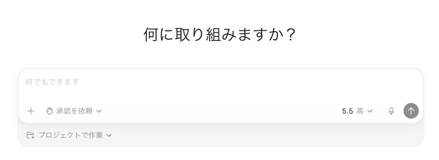
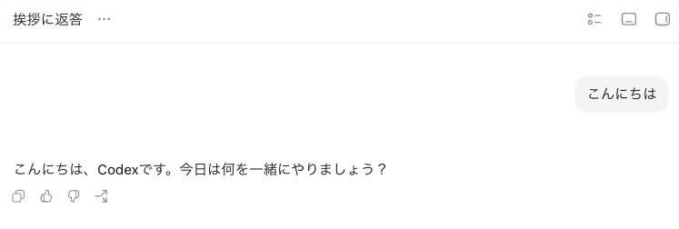

======================================================================
Codex開発基礎
======================================================================

:Event: 小規模開発のリアルを語ろう
:Presented: 2026/06/23 nikkie（Codex Ambassador直伝！）

Codex App を使った開発を体験しましょう
======================================================================

* まずはインストールを
* nikkieはデモの都合で ``/高速``

Codex Appインストール
---------------------------------------------------

* Appタブ https://developers.openai.com/codex/quickstart#setup
* macOSまたはWindows（Linuxの方ごめんなさい）
* ChatGPTのアカウントでサインイン

お前、誰よ
======================================================================

* nikkie（にっきー） [#nikkie-uuid]_
* 機械学習エンジニア（`サマーインターン募集中 <https://hrmos.co/pages/uzabase/jobs/Newgrads28_002>`__）・`Speeda AI Agent <https://www.uzabase.com/jp/info/20250901/>`__ 開発（`A2A提供 <https://jp.ub-speeda.com/news/20260319/>`__）

.. image:: ../_static/uzabase-white-logo.png

.. [#nikkie-uuid] UUID `28fb3f96-a221-462c-93bd-567b431715b9 <https://x.com/ftnext/status/2041119610368602138>`__

Codex App触っていきましょう
======================================================================

ユースケースを体験しましょう

.. TODO 導入方法を$openai-docsで聞いてスライドに反映

Codex [#codex-jp-page]_
======================================================================

* powered by **ChatGPT** (OpenAI)
* ChatGPT **無料版でも** 使えます（アカウントでサインイン）

.. [#codex-jp-page] https://openai.com/ja-JP/codex/

.. APIキーでも使える

多様な形態 [#codex-quickstart]_
---------------------------------------------------

* **App**
* CLI
* IDE拡張
* Web

.. [#codex-quickstart] https://developers.openai.com/codex/quickstart#setup

料金体系
---------------------------------------------------

* ChatGPT Plus以上だと **5時間** 利用枠と **1週間** 利用枠がある
* 両方の枠内でなら追加課金不要
* 5月に試したところ、Plusの5時間利用枠は20$ APIキーに課金する元が十分取れた

Codex Appインストール（みなさんは済み）
---------------------------------------------------

https://developers.openai.com/codex/app#getting-started

言語設定
---------------------------------------------------

* Settings（左下） > Settings > General > General > Language > 日本語
* 設定（左下） > 設定 > 一般 > 一般 > 言語 > 日本語
* 副作用として *コマンドまで日本語化* されます

チャットしてみる
======================================================================

「こんにちは」
---------------------------------------------------

モデルと推論（例「5.5 中」）
---------------------------------------------------

* モデル：GPT-5.5（過去のモデルも選べます）
* 推論：低(low)・中(medium)・**高(high)**・非常に高い(xhigh)

「速度」に注意⚠️
---------------------------------------------------

* 「高速」はここぞというときに（デフォルトでONかも）
* **「標準」で十分** です
* 設定の 一般 > 速度

スレッドという概念
---------------------------------------------------

* **1つのチャットが1スレッド**
* 話題が変わったら新しいチャット（スレッド）にしましょう
* 何スレッドも同時にやりやすくてApp推し（*git worktree* との相性もよし）

.. https://developers.openai.com/codex/prompting#threads

スレッドの操作
---------------------------------------------------

* アーカイブ（不要になったら非表示に）
* ピン
* :kbd:`⌘+K` :kbd:`Ctrl+K` のメニューで移動

コードベースを理解する
======================================================================

.. 「コードを書かずに簡単なものを作ってみましょう」に代えて

.. https://developers.openai.com/codex/use-cases/codebase-onboarding

**プロジェクト** 設定
---------------------------------------------------

* チャットではなくその上の「プロジェクト」
* 「既存のフォルダーを使用」から読ませたいディレクトリを選択
* 例：`Django <https://github.com/django/django>`__ をcloneしてきた

.. Playgroundプロジェクト

自然言語でコードベースに質問
---------------------------------------------------

    Tell me about this project

.. Django 6 の目玉機能を教えて
    どのように実装されているか教えて

Codexのイメージはシェル芸人
---------------------------------------------------

* プロジェクトのルートディレクトリしか知らない
* **コマンドを実行して調査**。回答を返す

もちろん開発もできます
---------------------------------------------------

* コードを書かせる（+ ``/プランモード``）
* `/コードレビュー <https://developers.openai.com/codex/app/review>`__

**代理で承認**
---------------------------------------------------

* Codexがコマンドを実行したいとき、人間に許可を求める
* 「代理で承認」は、人間の代わりに（別の）Codexが許可・拒否を判断する（おすすめ）
* 設定 > 権限 > 自動レビュー（有効にする）

.. https://developers.openai.com/codex/concepts/sandboxing

.. 詳しくは permission と workspace の権限

.. Slash command /init 紹介

Codex App、**めっちゃ高機能**！
---------------------------------------------------

https://developers.openai.com/codex/app/features

おすすめ動画
------------------------------------------------------------

.. raw:: html

    <iframe width="560" height="315" src="https://www.youtube-nocookie.com/embed/LoX9_dnXthc?si=pzwvD_FUClL1bzcg" title="YouTube video player" frameborder="0" allow="accelerometer; autoplay; clipboard-write; encrypted-media; gyroscope; picture-in-picture; web-share" referrerpolicy="strict-origin-when-cross-origin" allowfullscreen></iframe>

Codexに専門知識を与える
======================================================================

*Agent Skills*

OpenAIのドキュメントに質問できる
---------------------------------------------------

* 「チャット」セクションにて $openai ->「OpenAI Docs」選択（システムに組み込みのスキル）

    $openai-docs Responses APIについて教えて

.. _Agent Skills: https://agentskills.io/home

`Agent Skills`_
---------------------------------------------------

* Anthropic提案

    extending AI agent capabilities with specialized knowledge and workflows.

* どんな専門知識があるかだけ知っている（nameとdescription）。詳細を参照するのは必要になった時

$openai-docs
---------------------------------------------------

    Use when the user asks how to build with OpenAI products or APIs,（略）(*description*)

* 「OpenAIのResponses APIについて教えて」でも（多数の場合）発火

$openai-docs の仕組み
---------------------------------------------------

* OpenAIは `開発者ドキュメントのMCPサーバ <https://developers.openai.com/learn/docs-mcp>`__ を提供（MCPクライアントから誰でも使えます）
* `$openai-docs <https://github.com/openai/codex/tree/rust-v0.142.0/codex-rs/skills/src/assets/samples/openai-docs>`__ skill記載の使い方に沿って、CodexがMCPサーバを使っているだけ

$openai-docs にはCodexの質問も可能
---------------------------------------------------

https://developers.openai.com/codex/codex-manual.md に基づいて回答する仕組みあり

IMO：この世は *スキルゲー*（**専門知識の装備**）
---------------------------------------------------

* `$find-skills <https://github.com/vercel-labs/skills/blob/main/skills/find-skills/SKILL.md>`__
* `$grilling <https://github.com/mattpocock/skills/blob/main/skills/productivity/grilling/SKILL.md>`__ （尋問してきます）
* `$superpowers <https://github.com/openai/plugins/tree/main/plugins/superpowers>`__ （後述の *プラグイン*。入念に設計してからテスト駆動開発で実装）

スキルをインストールするツール
---------------------------------------------------

* Codex Appには `$skill-installer <https://github.com/openai/codex/tree/rust-v0.142.0/codex-rs/skills/src/assets/samples/skill-installer>`__ （組み込み）
* Vercelによる npx `skills <https://www.npmjs.com/package/skills>`__
* `gh skills <https://cli.github.com/manual/gh_skill>`__ や `apm <https://github.com/microsoft/apm>`__ もある（どれか1ツールで十分です）

プラグインでCodexに開発させる
======================================================================

例：OpenAIのAPIを使ったアプリケーション開発

.. revealjs-break::
    :notitle:

.. raw:: html

    <blockquote class="twitter-tweet" data-lang="ja" data-align="center" data-dnt="true">
Use the OpenAI Developers plugin in Codex to build faster with OpenAI tools by setting up API keys, finding the right docs, and debugging along the way. <a href="https://t.co/ztBd3h3oeb">pic.twitter.com/ztBd3h3oeb</a>
&mdash; OpenAI Developers (@OpenAIDevs) <a href="https://x.com/OpenAIDevs/status/2066634415955136728?ref_src=twsrc%5Etfw">2026年6月15日</a></blockquote>  

プラグインとは
---------------------------------------------------

* MCPサーバ
* Agent Skill
* *アプリ*

OpenAI Developersプラグイン
---------------------------------------------------

.. _APIキー: https://platform.openai.com/api-keys

Codexに指示して `APIキー`_ を作る
---------------------------------------------------

    Create a new API key.

OpenAIにクレジットカード登録が必要と思われます

Responses APIを使ったチャットアプリ
---------------------------------------------------

    Implement a chatbot using responses API and a voice chat mode using Realtime API

Pythonで

.. hatch-pet

Codex Appで業務自動化も
======================================================================

* コーディング以外もお任せ！
* `（ほぼ）あらゆる作業に対応する Codex <https://openai.com/ja-JP/index/codex-for-almost-everything/>`__ (Codex for (almost) everything)

.. revealjs-break::
    :notitle:

.. raw:: html

    <blockquote class="twitter-tweet" data-lang="ja" data-align="center" data-dnt="true">
Show Codex a workflow once. Reuse it as a skill.  Record &amp; Replay lets you show Codex a recurring task, like filing an expense report or submitting a time-off request.  Codex turns that demo into an inspectable, editable skill.  You control when recording starts and stops. <a href="https://t.co/UqSGaO7XUs">pic.twitter.com/UqSGaO7XUs</a>
&mdash; OpenAI Developers (@OpenAIDevs) <a href="https://x.com/OpenAIDevs/status/2067681320281723113?ref_src=twsrc%5Etfw">2026年6月18日</a></blockquote>

まとめ🌯：Codex開発基礎
======================================================================

* Codex Appをインストール
* 既存のコードベースをプロジェクトに開き自然言語で質問
* Agent Skillsで専門知識を与える
* OpenAI Developersプラグインでアプリ開発

Codex App以外にも適用できる考え方
---------------------------------------------------

* 話題が変わったらスレッド（セッション）は分ける
* 装備させたい専門知識を設定しましょう（Agent Skills + MCP）

ご清聴ありがとうございました！
--------------------------------------------------

Happy Development♪
