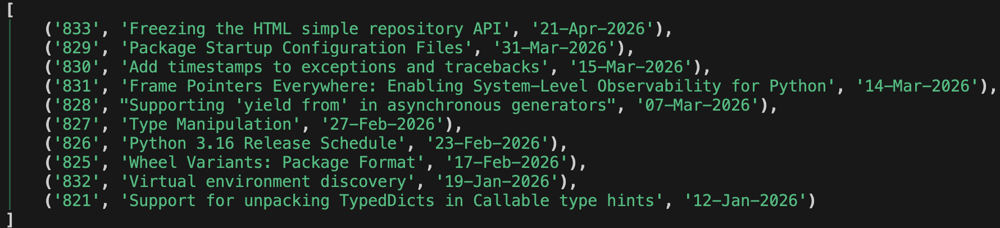

======================================================================
こんなPythonロギングはどうだい！？
======================================================================

:Event: Tachikawa.any #1
:Presented: 2026/05/12 nikkie

㊗️Tachikawa.any 爆誕！🎂
======================================================================

.. raw:: html

    <iframe class="speakerdeck-iframe" style="border: 0px; background: padding-box rgba(0, 0, 0, 0.1); margin: 0px; padding: 0px; border-radius: 6px; box-shadow: rgba(0, 0, 0, 0.2) 0px 5px 40px; width: 100%; height: auto; aspect-ratio: 560 / 315;" frameborder="0" src="https://speakerdeck.com/player/e911e6e737af49f99f134adf493fa899?slide=18" title="ご機嫌に学べ - 寝ぼけ眼の親たちへ贈る_友の輪_駆動開発 - " allowfullscreen="true" allow="web-share" data-ratio="1.7777777777777777"></iframe>

nikkieと立川
======================================================================

* 今日は吉祥寺より先まで中央線グリーン車でおトク！
* **シネマシティ**、だいすき！
* 超かぐや姫！の舞台！！

これすき
---------------------------------------------------

.. raw:: html

    <blockquote class="twitter-tweet" data-lang="ja" data-align="center" data-dnt="true">
彩葉は感動すると 放心状態になるタイプのオタクなので 乙女っぽいポーズをしています🦊<a href="https://twitter.com/hashtag/GW%E3%81%AF%E8%B6%85%E3%81%8B%E3%81%90%E3%82%84%E5%A7%AB?src=hash&amp;ref_src=twsrc%5Etfw">#GWは超かぐや姫</a> <a href="https://t.co/VAXLiHCYYE">pic.twitter.com/VAXLiHCYYE</a>
&mdash; 『超かぐや姫！』公式 (@Cho_KaguyaHime) <a href="https://twitter.com/Cho_KaguyaHime/status/2049428729701487012?ref_src=twsrc%5Etfw">2026年4月29日</a></blockquote> 

こんなPythonロギングはどうだい！？
======================================================================

.. code-block:: shell

    % happy-python-logging run --log-config httpxyz=debug example.py

`happy-python-logging <https://pypi.org/project/happy-python-logging/>`__

最新のPEPを取得するスクリプト
---------------------------------------------------

.. literalinclude:: example.py
   :language: python
   :caption: :file:`example.py`

.. revealjs-break::

* HTTPクライアント HTTPXYZ [#fall-in-love-with-httpxyz]_
* カラフルな出力 Rich

.. [#fall-in-love-with-httpxyz] 推しの非同期サポートHTTPクライアントです。拙ブログ `君は HTTPXYZ を知っているか  <https://nikkie-ftnext.hatenablog.com/entry/do-you-know-httpxyz-friendly-fork-httpx>`__

ライブラリHTTPXYZの作者によるロギング
======================================================================

https://codeberg.org/httpxyz/httpxyz/src/tag/0.31.1/httpxyz/_client.py

.. code-block:: python

    logger = logging.getLogger("httpxyz")  # L117

.. code-block:: python

    logger.info(  # L1032
        'HTTP Request: %s %s "%s %d %s"',
        request.method,
        request.url,
        response.http_version,
        response.status_code,
        response.reason_phrase,
    )

仕込まれたロギングを見たい私（*束縛系*）は
---------------------------------------------------

.. literalinclude:: example_debug.py
   :language: python
   :lines: 7-14
   :caption: :file:`example.py` にロギングの実装を追加

.. code-block:: txt

    2026-05-11 20:32:15,259 | INFO (httpxyz) | _client.py:_send_single_request:1032 - HTTP Request: GET https://peps.python.org/api/peps.json "HTTP/1.1 200 OK"

ロガー・ハンドラ・フォーマッタを設定 🏃‍♂️
---------------------------------------------------

* PyCon JP 2025 で話しています！ [#pyconjp-2026-cfp]_
* `標準ライブラリのlogging、レゴブロックのように組合せてロギングできることを理解しよう！ <https://2025.pycon.jp/ja/timetable/talk/Z8ZYFA>`__
* 動画 https://www.youtube.com/watch?v=tSuSr2jFE0Q

.. [#pyconjp-2026-cfp] `PyCon JP 2026 Call for Proposals を開始しました <https://pyconjp.blogspot.com/2026/04/pycon-jp-2026-call-for-proposals.html>`__ （5/31(日)まで）

ボイラープレートコードが多い -> **設定ファイル** で外出し
-------------------------------------------------------------

.. literalinclude:: config.toml
   :language: toml
   :caption: tomllib.load して `logging.config.dictConfig <https://docs.python.org/ja/3/library/logging.config.html#logging.config.dictConfig>`__ に渡します

ところで ``RUST_LOG`` っていいですね
======================================================================

.. code-block:: shell

    $ RUST_LOG=codex_core=trace codex exec "print hello" --skip-git-repo-check

バイナリ実行中のログレベルを外から制御できる！ [#codex-cli-logging-breaking-news]_

.. [#codex-cli-logging-breaking-news] 拙ブログ `【速報】nikkie氏、ついに Codex CLI から Responses API へのリクエストを覗くことに成功！ <https://nikkie-ftnext.hatenablog.com/entry/codex-cli-rust-log-env-var-responses-api-request-json>`__

``RUST_LOG`` 関係者
---------------------------------------------------

* `env_logger <https://docs.rs/env_logger/latest/env_logger/>`__

    The ``RUST_LOG`` environment variable controls logging with the syntax:

* `tracing_subscriber <https://docs.rs/tracing-subscriber/latest/tracing_subscriber/>`__

``PYTHON_LOG`` が私は欲しいぞ！
======================================================================

.. code-block:: shell

    $ PYTHON_LOG=httpxyz=debug happy-python-logging run example.py

.. code-block:: shell

    % happy-python-logging run --log-config httpxyz=debug example.py

``happy-python-logging run``
---------------------------------------------------

* Python使いをロギングで幸せにするために始動
* あるライブラリをちょっとロギングしたいだけなのに、 **なんで何行も書かないといけないのか** （仕組みを理解した上で）

「HTTPXYZは今だけdebugレベルで」
---------------------------------------------------

.. literalinclude:: example.py
   :language: python
   :caption: :command:`PYTHON_LOG=httpxyz=debug happy-python-logging run example.py`

.. _runpy.run_path: https://docs.python.org/ja/3/library/runpy.html#runpy.run_path

アイデア `runpy.run_path`_
---------------------------------------------------

* ``python path/to/script`` 相当
* ``PYTHON_LOG`` に沿ったロギング設定をしてからスクリプト実行
* Opus 4.7とGPT-5.5の実装・レビュー `20往復 <https://github.com/ftnext/happy-python-logging/pull/3>`__ でこれは消えた...（別の実装に）

まとめ：こんなPythonロギングはどうだい！？
======================================================================

* ``RUST_LOG`` ならぬ ``PYTHON_LOG``
* ロギングのコードを書かずにロギングできる :command:`happy-python-logging run` お試しあれ！

.. code-block:: shell

    $ PYTHON_LOG=httpxyz=debug happy-python-logging run example.py

ご清聴ありがとうございました！
---------------------------------------------------

* nikkie（にっきー）・Python使い・:fab:`github` `@ftnext <https://github.com/ftnext>`__ `ブログ <https://nikkie-ftnext.hatenablog.com/>`__ 連続1250日突破
* 機械学習エンジニア。 `Speeda AI Agent <https://jp.ub-speeda.com/news/speeda-promotion-gallery/>`__ 開発（`We're hiring! <https://hrmos.co/pages/uzabase/jobs/1829077236709650481>`__）

.. image:: ../_static/uzabase-white-logo.png

本LTタイトルはこちらから
---------------------------------------------------

.. raw:: html

    <iframe width="560" height="315" src="https://www.youtube-nocookie.com/embed/KGkdhAjWfSo?si=XyQPxWQhwFoGfDqj&amp;start=46" title="YouTube video player" frameborder="0" allow="accelerometer; autoplay; clipboard-write; encrypted-media; gyroscope; picture-in-picture; web-share" referrerpolicy="strict-origin-when-cross-origin" allowfullscreen></iframe>

happy-python-logging命名インスパイア
---------------------------------------------------

.. raw:: html

    <iframe width="560" height="315" src="https://www.youtube-nocookie.com/embed/uMY_qIoWgnk?si=Dzsc6Bma1_p4M3he" title="YouTube video player" frameborder="0" allow="accelerometer; autoplay; clipboard-write; encrypted-media; gyroscope; picture-in-picture; web-share" referrerpolicy="strict-origin-when-cross-origin" allowfullscreen></iframe>

EOF
---
